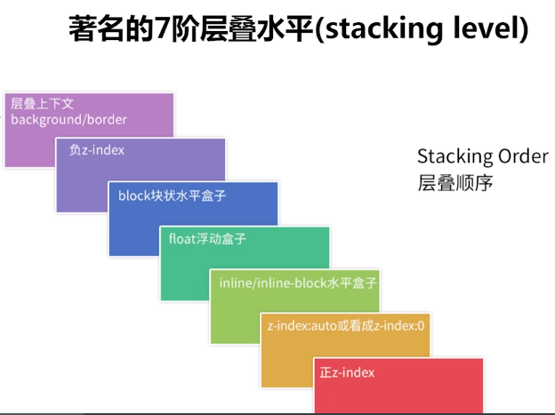

# CSS布局
## 1.实现两栏/三栏布局的方法?
1. 表格布局
2. float + margin布局
3. inline-block布局
4. flexbox布局（兼容性的问题）

### 1.1 基础布局
```html
<style>
    * {
        margin: 0;
        padding: 0;
    }
    .layout {
        margin-top: 10px;
    }
    .layout div{
        min-height: 100px;
    }
</style>
<body>
  <!--1.浮动的方式来实现布局-->
  <section class="layout float">
      <style>
          .layout.float .left {
              float: left;
              width: 300px;
              background-color: #48adff;
          }
          .layout.float .main {
              background-color: #ff4344;
          }
      </style>
      <article class="left-main">
          <div class="left"></div>
          <div class="main">
              <h1>浮动两栏布局</h1>
              <p>两栏布局的中间部分</p>
              <p>两栏布局的中间部分</p>
          </div>
      </article>
  </section>

  <!--2.定位的方式来实现布局-->
  <section class="layout absolute">
      <style>
          .layout.absolute .left-main {
              width: 100%;
          }
          .layout.absolute .left {
              left : 0;
              width: 300px;
              background-color: #48adff;
              position: absolute;
          }
          .layout.absolute .main {
              /*默认是以正常文档流的方式来展现的*/
              background-color: #ff4344;
              margin-left: 300px;
              right: 0;
          }
      </style>
      <article class="left-main">
          <div class="left"></div>
          <div class="main">
              <h1>绝对定位两栏布局</h1>
              <p>两栏布局的中间部分</p>
              <p>两栏布局的中间部分</p>
          </div>
      </article>
  </section>

  <!--3.flex布局的实现-->
  <section class="layout flex">
      <style>
          .layout .left-main {
              display: flex;
          }
          .layout .left {
              width: 300px;
              background-color: #48adff;
          }
          .layout .main {
              flex: 1;
              background-color: #ff4344;
          }
      </style>
      <article class="left-main">
          <div class="left"></div>
          <div class="main">
              <h1>flex两栏布局</h1>
              <p>两栏布局的中间部分</p>
              <p>两栏布局的中间部分</p>
          </div>
      </article>
  </section>

  <!--4.table布局的实现-->
  <section class="layout table">
      <style>
          .layout .left-main {
              display: table;
              width: 100%;
          }
          .layout .left {
              display : table-cell;
              width: 300px;
              background-color: #48adff;
          }
          .layout .main {
              background-color: #ff255f;
          }
      </style>
      <article class="left-main">
          <div class="left"></div>
          <div class="main">
              <h1>table两栏布局</h1>
              <p>两栏布局的中间部分</p>
              <p>两栏布局的中间部分</p>
          </div>
      </article>
  </section>

  <!--5.grid布局-->
  <section class="layout grid">
      <style>
          .layout.grid .left-main {
              display: grid;
          }
          .layout.grid .left-main {
              grid-template-rows : 100px;
              /*按照顺序指定盒子的宽度*/
              grid-template-columns : 300px  auto;
          }
          .layout.grid .left {
              background-color: #48adff;
          }
          .layout.grid .main {
              background-color: #ff4344;
          }
      </style>
      <article class="left-main">
          <div class="left"></div>
          <div class="main">
              <h1>grid两栏布局</h1>
              <p>两栏布局的中间部分</p>
              <p>两栏布局的中间部分</p>
          </div>
      </article>
  </section>
</body>
```

### 1.2 圣杯布局
```html
<!DOCTYPE html>
<html>
  <head>
    <meta charset="utf-8" />
    <title>实现三栏水平布局之圣杯布局</title>
    <style type="text/css">
      /*基本样式*/
      .left, .right, .main {
        min-height: 300px;
      }
      .left {
        width: 200px;
        background-color:thistle;
      }
      .main {
        background-color: #999;
      }
      .right {
        width: 300px;
        background-color: violet;
      }
      /* 圣杯布局关键代码 */
      .left, .main, .right {
        float: left;
        position: relative;
      }
      .main {
        width: 100%;
      }
      .container {
        padding-left: 200px;
        padding-right: 300px;
      }
      .left {
        margin-left: -100%;
        left: -200px;
      }
      .right {
        margin-left: -300px;
        right: -300px;
      }
    </style>
  </head>
  <body>
    <div class="container">
      <div class="main">main</div>
      <div class="left">left</div>
      <div class="right">right</div>
    </div>
  </body>
</html>
```

### 1.3 双飞翼布局
```html
<!DOCTYPE html>
<html lang="en">
  <head>
    <meta charset="UTF-8" />
    <meta name="viewport" content="width=device-width, initial-scale=1.0" />
    <meta http-equiv="X-UA-Compatible" content="ie=edge" />
    <title>双飞翼布局</title>
    <style>
      .left,
      .right,
      .main {
        min-height: 200px;
      }
      .left {
        width: 200px;
        background-color: thistle;
      }
      .main {
        background: #999;
      }
      .right {
        width: 300px;
        background-color: violet;
      }
      /* 双飞翼布局重点 */
      .left,
      .main,
      .right {
        float: left;
      }
      .main {
        width: 100%;
      }
      .main-inner {
        margin-left: 200px;
        margin-right: 300px;
      }
      .left {
        margin-left: -100%;
      }
      .right {
        margin-left: -300px;
      }
    </style>
  </head>
  <body>
    <div class="main"><div class="main-inner">中心区</div></div>
    <div class="left">left</div>
    <div class="right">right</div>
  </body>
</html>
```

## 2.absolute/fixed/static/sticky定位?
1. 前者相对于最近的absolute/relative
2. 后者相对于屏幕进行定位
3. fixed是相对于屏幕的可视区域的，也会直接脱离于文档流独立存在的
4. 元素未滚动，在当前可视区域他的top值不生效，只有margin生效，滚动起来后margin失效，top值生效
  
```html
<style type="text/css">
  p{
  font-size:11pt;
  color:#363636;
  text-indent:2em;
  }
  .parent{
  width:500px;
  height:150px;
  margin-top:20px;
  margin-left:20px;
  border:solid 1px #555555;
  background:#aaaaaa;
  }
  .parent div{
  width:100px;
  height:80px;
  float:left;
  background:#708090;
  border:dashed 1px #008B8B;
  font-size:12pt;
  font-weight:bold;
  color:#104E8B;
  }
</style>
</head>
<body>
  <!--相对定位!-->
  <h2>relative</h2>
  <p>相对定位是一个非常容易掌握的概念。如果对一个元素进行相对定位，它将出现在它所在的位置上。然后，可以通过设置垂直或水平位置，让这个元素“相对于”它的起点进行移动。</p>
  <div class="parent">
  <div>child 1</div>
  <div style="position:relative;left:20px;top:20px;">child 2</div>
  <div>child 3</div>
  </div>
 
<!--绝对定位!-->
<h2>absolute</h2>
<p>绝对定位的元素的位置相对于最近的已定位祖先元素，如果元素没有已定位的祖先元素，那么它的位置相对于最初的包含块。
对于定位的主要问题是要记住每种定位的意义。</p>
<p>绝对定位是“相对于”最近的已定位祖先元素，如果不存在已定位的祖先元素，那么“相对于”最初的包含块。所以如果要设定元素与其父元素的绝对位置定位就必须设定父元素的定位。</p>
<p>注释：根据用户代理的不同，最初的包含块可能是画布或 HTML 元素。</p>
<div class="parent" style="position:relative;"<!--如果该处不定位，那么child5框的定位是相对于最初的包含块!-->>
<div>child 4</div>
<div style="position:absolute;left:20px;top:20px;">child 5</div>
<div>child 6</div>
</div>
 
<!--相对定位!-->
<h2>fixed</h2>
<p>元素框的表现类似于将 position 设置为 absolute，不过其包含块是视窗本身。</p>
<div class="parent">
<div>child 7</div>
<div style="position:fixed;right:20px;top:20px;">child 8</div>
<div>child 9</div>
</div>

<!--相对定位!-->
<h2>static</h2>
<p>元素框正常生成。块级元素生成一个矩形框，作为文档流的一部分，行内元素则会创建一个或多个行框，置于其父元素中。</p>
<div class="parent">
<div>child 10</div>
<div style="position:static;right:20px;top:20px;">child 11</div>
<div>child 12</div>
</div>
</body>
```

## 3.什么是层叠上下文？如何形层叠上下文？层叠顺序是怎样的？
```html
<style>
    .father-green {
        width:500px;
        height:300px;
        background-color:green;
    }
    .son-red {
        width:200px;
        height:100px;
        background-color:red;
        display:inline-block;
    }
    .subson-yellow {
        height:50px;
        width:200px;
        background-color: yellow;
        
    }
    .son-purple {
        width: 200px;
        height:100px;
        background-color:purple;
        display:inline-block;
        margin-left:-50px;
    }
    .mather-pink {
        width: 300px;
        height:100px;
        background-color:pink;
    }
    .daughter-blue {
        width:100px;
        height:50px;
        background-color:blue;
        margin-top:-20px;
    }
</style>
<body>
    <div class="father-green">
        <div class="son-red">
            <div class="subson-yellow">
                我是孙子辈的我是孙子辈的我是孙子辈的
            </div>
        </div>
        
        <div class="son-purple">
            我是第二个子元素
        </div>
    </div>
    <div class="mather-pink"><div class="daughter-blue">daughter-blue</div>
    </div>
</body>    
```

### 3.1 形成层叠上下文的方法？
+ 根元素 <html></html>
+ position值为 absolute|relative，且 z-index值不为 auto
+ position 值为 fixed|sticky
+ z-index 值不为 auto 的flex元素，即：父元素 display:flex|inline-flex
+ opacity 属性值小于 1 的元素
+ transform 属性值不为 none的元素
+ mix-blend-mode 属性值不为 normal 的元素
+ filter、 perspective、 clip-path、 mask、 mask-image、 mask-border、 motion-path 值不为none 的元素
+ perspective 值不为 none 的元素
+ isolation 属性被设置为 isolate 的元素
+ will-change 中指定了任意 CSS 属性，即便你没有直接指定这些属性的值
+ -webkit-overflow-scrolling 属性被设置 touch的元素

> [!NOTE]
> - 层叠上下文可以包含在其他层叠上下文中，并且一起组建了一个有层级的层叠上下文
> - 每个层叠上下文完全独立于它的兄弟元素，当处理层叠时只考虑子元素，这里类似于BFC
> - 每个层叠上下文是自包含的：当元素的内容发生层叠后，整个该元素将会在父级叠上下文中按顺序进行层叠

### 3.2 CSS层叠上下优先级

+ 1.形成堆叠上下文环境的元素的背景与边框
+ 2.拥有负 z-index 的子堆叠上下文元素 （负的越高越堆叠层级越低）
+ 3.正常流式布局，非 inline-block，无 position 定位（static除外）的子元素
+ 4.无 position 定位（static除外）的 float 浮动元素
+ 5.正常流式布局， inline-block元素，无 position 定位（static除外）的子元素（包括 display:table 和 display:inline ）
+ 6.拥有 z-index:0 的子堆叠上下文元素
+ 7.拥有正 z-index: 的子堆叠上下文元素（正的越低越堆叠层级越低）

### 3.3 层叠上下文的堆叠顺序？


> [!NOTE]
> 总结：层叠上下文（border/background）< 负z-index < block块状盒子 < 浮动的盒子 < inline/inline-block水平盒子 < z-index:auto 或者 z-index:0 < 正z-index（定位并设定了正的z-index值，z-index值越大 层级越高）


## 4.如何解决inline-block 的间隙问题？
### 4.1 字符间距问题
```html
<style>
*{
        margin: 0;
        padding: 0;
    }
    ul{
        list-style: none;
    }
    li{
        display: inline-block;
        width: 100px;
        height: 100px;
        background: red;    
    }
</style>
<ul>
    <li>111</li>
    <li>222</li>
    <li>333</li>
    <li>444</li>
    <li>555</li>
</ul>
```

### 4.2 解决方法
+ 1.解决方法1：直接删除换行符（IE1像素残留）
+ 2.设置父元素的font-size为0，在子元素重新设置字体大小（低版本safari 兼容性）
+ 3.父元素 设置font-size：0 ；letter-spacing：-3px ，子元素重新设置font-size（推荐方案）

## 5.BFC是什么？如何清除浮动？
> BFC：浮动元素和绝对定位元素，非块级盒子的块级容器（例如 inline-blocks, table-cells, 和 table-captions），以及overflow值不为“visiable”的块级盒子，都会为他们的内容创建新的BFC（块级格式上下文）。它是指一个独立的块级渲染区域，只有Block-level BOX参与，该区域拥有一套渲染规则来约束块级盒子的布局，且与区域外部无关

### 5.1 如何触发BFC?
+	float的值不为none
+	overflow的值不为visible
+	display的值为inline-block、table-cell、table-caption
+	position的值为absolute或fixed

### 5.2 BFC布局规则
1. 内部的Box会在垂直方向，一个接一个地放置。
2. Box垂直方向的距离由margin决定。属于同一个BFC的两个相邻Box的**margin会发生重叠（高频考点）**
3. 每个元素的margin box的左边， 与包含块border box的左边相接触(对于从左往右的格式化，否则相反)。即使存在浮动也是如此。
4. BFC的区域不会与float box重叠。
5. BFC就是页面上的一个隔离的独立容器，容器里面的子元素不会影响到外面的元素。反之也如此。
6. 计算BFC的高度时，浮动元素也参与计算
  
### 5.3 如何清除浮动？
1. 原因：浮动的元素不会占据父元素的布局空间（父元素布局不会管浮动元素）
2. 清除方式： 让盒子负责自己的布局：

#### 5.3.1 添加额外标签
```html
<div class="main left">.main{float:left;}</div>
<div class="side left">.side{float:right;}</div>
<div style="clear:both;"></div>
</div>
<div class="footer">.footer</div>
```  

#### 5.3.2 父元素设置 overflow：hidden
```html
<div class="wrap" id="float3" style="overflow:hidden; *zoom:1;">
<h2>3)父元素设置 overflow </h2>
<div class="main left">.main{float:left;}</div>
<div class="side left">.side{float:right;}</div>
</div>
<div class="footer">.footer</div>
```

#### 5.3.3 使用:after 伪元素
```html
<style type="text/css">
 .clearfix:after {  
   content: ".";
    display: block; 
    height: 0; 
    clear: both; 
    visibility: hidden;  
    }  
.clearfix {
  display: inline-block;
  *zoom:1;
  }  /* for IE/Mac */  
</style>
<!--[if IE]>
 <style type="text/css">
 .clearfix {zoom: 1;/* triggers hasLayout */  display: block;/* resets display for IE/Win */} </style>
<![endif]-->
```

#### 5.3.4 双伪元素清除法(推荐)
```css
.clearfix:before,.clearfix:after{
   content:"";
   display:table;
}
.clearfix:after{
  clear:both;
}
.clearfix{
  *zoom:1;
}
```

## 6.如何适配移动端？
### 6.1 viewport进行缩放
```html
<meta name="viewport" content="width=device-width,initial-scale=1">
```

### 6.2 使用rem
rem是什么(CSS3新增)，初始值：1rem=16px？
rem（font size of the root element）是指相对于根元素的字体大小的单位。简单的说它就是一个相对单位
> [!NOTE]
> rem(1rem = 16px) / viewport（固定宽度） / media query（屏幕大小自适应）

### 6.3 设计上（响应式方法）
隐藏（移动端隐藏元素） 折行（横排变纵排） 自适应（留下自适应的空间）（media query）

### 6.4 固定宽度做法
定宽布局（版心）

## 7.em和rem的区别？
1. rem 单位翻译为像素值是由 html 元素的字体大小决定的。 此字体大小会被浏览器中字体大小的设置影响，除非显式重写一个具体单位。
2. em 单位转为像素值，取决于他们使用的字体大小。 此字体大小受从父元素继承过来的字体大小，除非显式重写与一个具体单位


## 8.垂直居中的6中实现方式？
### 8.1 方法一：基于视口的垂直居中
```html
<!DOCTYPE html>
<html lang="en">
  <head>
    <meta charset="UTF-8" />
    <meta name="viewport" content="width=device-width, initial-scale=1.0" />
    <meta http-equiv="X-UA-Compatible" content="ie=edge" />
    <title>垂直居中</title>
  </head>
  <style>
    .wrapper {
      overflow: hidden;
      width: 1000px;
      height: 500px;
      background: #999;
    }
    .center {
      width: 18em;
      height: 10em;
      text-align: center;
      background-color: orange;
      color: #fff;


      /* 1vh = 1% * 视口高度 */
      margin: 50vh auto;
      transform: translateY(-50%);
    }

  </style>
  <body>
    <div class="wrapper">
      <div class="center">
        基于视口的垂直居中<br />
        不要求原生有固定的宽高。<br />
        但是这种居中是在整个页面窗口内居中，不是基于父元素<br />

      </div>
    </div>
  </body>
</html>

```

### 8.2 方法二：定宽居中
```html
<!DOCTYPE html>
<html lang="en">
  <head>
    <meta charset="UTF-8" />
    <meta name="viewport" content="width=device-width, initial-scale=1.0" />
    <meta http-equiv="X-UA-Compatible" content="ie=edge" />
    <title>垂直居中</title>
  </head>
  <style>
    .center {
      width: 18em;
      height: 10em;
      text-align: center;
      background-color: orange;
      color: #fff;

      position: absolute;
      top: 50%;
      left: 50%;
      margin-left: -9rem;
      margin-top: -5rem;
    }
  </style>
  <body>
    <div class="center">
        要求原生有固定的宽高。<br/>
        position: absolute;<br/>
        top和left 为 50%;<br/>
        margin上为高的一半<br/>
        margin左为宽的一半<br/>
    </div>

  </body>
</html>

```
### 8.3 方法三：calc居中
```html
<!DOCTYPE html>
<html lang="en">
  <head>
    <meta charset="UTF-8" />
    <meta name="viewport" content="width=device-width, initial-scale=1.0" />
    <meta http-equiv="X-UA-Compatible" content="ie=edge" />
    <title>垂直居中</title>
  </head>
  <style>
    .center {
      width: 18em;
      height: 10em;
      text-align: center;
      background-color: orange;
      color: #fff;

      position: absolute;
      top: calc(50% - 5em);
      left: calc(50% - 9em);
    }
  </style>
  <body>
    <div class="center">
        要求原生有固定的宽高。<br/>
        position: absolute;<br/>
        top 为 calc(50% 剪 一半高)
        left 为 calc(50% 剪 一半宽)
    </div>

  </body>
</html>

```
### 8.4 方法四：transform居中
```html
<!DOCTYPE html>
<html lang="en">
  <head>
    <meta charset="UTF-8" />
    <meta name="viewport" content="width=device-width, initial-scale=1.0" />
    <meta http-equiv="X-UA-Compatible" content="ie=edge" />
    <title>垂直居中</title>
  </head>
  <style>
    .center {
      width: 18em;
      height: 10em;
      text-align: center;
      background-color: orange;
      color: #fff;

      position: absolute;
      top: 50%;
      left: 50%;
      transform: translate(-50%, -50%);
    }
  </style>
  <body>
    <div class="center">
        不要求原生有固定的宽高。<br/>
        position: absolute;<br/>
        top和left 为 50%;<br/>
        transform: translate(-50%, -50%);
    </div>

  </body>
</html>

```
### 8.5 方法五：flex居中方法1
```html
<!DOCTYPE html>
<html lang="en">
  <head>
    <meta charset="UTF-8" />
    <meta name="viewport" content="width=device-width, initial-scale=1.0" />
    <meta http-equiv="X-UA-Compatible" content="ie=edge" />
    <title>垂直居中</title>
  </head>
  <style>
    .wrapper {
      width: 1000px;
      height: 600px;
      background: #999;

      display: flex;
    }
    .center {
      width: 18em;
      height: 10em;
      text-align: center;
      background-color: orange;
      color: #fff;

      margin: auto;
    }
  </style>
  <body>
    <div class="wrapper">
      <div class="center">
        使用flex居中<br/>
        父元素 display: flex; <br/>
        居中块： margin: auto;
      </div>
    </div>
  </body>
</html>

```
### 8.6 方法六: flex居中方法2
```html
<!DOCTYPE html>
<html lang="en">
  <head>
    <meta charset="UTF-8" />
    <meta name="viewport" content="width=device-width, initial-scale=1.0" />
    <meta http-equiv="X-UA-Compatible" content="ie=edge" />
    <title>垂直居中</title>
  </head>
  <style>
    .wrapper {
      width: 1000px;
      height: 600px;
      background: #999;

      display: flex;
      /* 盒子横轴的对齐方式 */
      justify-content: center;
      /* 盒子纵轴的对齐方式 */
      align-items: center;
    }
    .center {
      width: 18em;
      height: 10em;
      text-align: center;
      background-color: orange;
      color: #fff;
    }
  </style>
  <body>
    <div class="wrapper">
      <div class="center">
        使用flex居中<br/>
        父元素 display: flex; <br/>
        justify-content: center;<br/>
        align-items: center;<br/>
      </div>
    </div>
  </body>
</html>

```
## 9.水平居中的4种实现方式？
### 9.1 方法一：text-align的center属性
```html
<!DOCTYPE html>
<html lang="en">
  <head>
    <meta charset="UTF-8" />
    <meta name="viewport" content="width=device-width, initial-scale=1.0" />
    <meta http-equiv="X-UA-Compatible" content="ie=edge" />
    <title>水平元素居中</title>
  </head>
  <style>
    .wrapper {
      text-align: center;
      height: 1000px;
    }
    .center {
      display: inline-block;
      width: 500px;
      height: 200px;
      
      background: orange;
    }
  </style>
  <body>
    <div class="wrapper">
      <div class="center">如果需要居中的元素为常规流中 inline / inline-block 元素，为父元素设置 text-align: center;</div>
    </div>
  </body>
</html>

```
### 9.2 方法二：margin的auto属性
```html
<!DOCTYPE html>
<html lang="en">
  <head>
    <meta charset="UTF-8" />
    <meta name="viewport" content="width=device-width, initial-scale=1.0" />
    <meta http-equiv="X-UA-Compatible" content="ie=edge" />
    <title>水平元素居中</title>
  </head>
  <style>
    .wrapper {
      width: 100%;
      height: 500px;

      text-align: center; /* 3 */
    }
    .center {
      width: 500px;
      text-align: left; 
      margin: 0 auto; 

      background-color: orange;
    }
  </style>
  <body>
    <div class="wrapper">
      <div class="center">
          父元素上设置 text-align: center;<br />
          居中元素上margin 为 auto。
      </div>
    </div>
  </body>
</html>

```
### 9.3 方法三：绝对定位
```html
<!DOCTYPE html>
<html lang="en">
  <head>
    <meta charset="UTF-8" />
    <meta name="viewport" content="width=device-width, initial-scale=1.0" />
    <meta http-equiv="X-UA-Compatible" content="ie=edge" />
    <title>水平元素居中</title>
  </head>
  <style>
    .wrapper {
      width: 80%;
      height: 500px;
      background: #888;
      
      position: relative;
    }
    .center {
      width: 500px;
      position: absolute;
      left: 50%;
      margin-left: -250px;

      background-color: orange;
    }
  </style>
  <body>
    <div class="wrapper">
      <div class="center">如果元素positon: absolute; 那么 0）设置父元素postion: relative 1）为元素设置宽度，2）偏移量设置为 50%，3）偏移方向外边距设置为元素宽度一半乘以-1</div>
    </div>
  </body>
</html>

```
### 9.4 方法四：相对定位
```html
<!DOCTYPE html>
<html lang="en">
  <head>
    <meta charset="UTF-8" />
    <meta name="viewport" content="width=device-width, initial-scale=1.0" />
    <meta http-equiv="X-UA-Compatible" content="ie=edge" />
    <title>水平元素居中</title>
  </head>
  <style>
    .wrapper {
      width: 80%;
      height: 500px;
      background: #888;
    }
    .center {
      width: 500px;
      position: relative;
      left: 50%;
      margin-left: -250px;

      background-color: orange;
    }
  </style>
  <body>
    <div class="wrapper">
      <div class="center">如果元素positon: relative。 那么 1）为元素设置宽度，2）偏移量设置为 50%，3）偏移方向外边距设置为元素宽度一半乘以-1</div>
    </div>
  </body>
</html>

```

## 10 居中问题要点总结
### 10.1 被居中元素宽高固定
#### 10.1.1 绝对定位+margin
top和left 为 50%， margin的left和top为自身宽高一半
```css
.center {
  position: absolute;
  top: 50%;
  left: 50%;
  margin-left: -9rem;
  margin-top: -5rem;
}
```

#### 10.1.2 绝对定位+calc
top和lefe为父元素一半剪自身一半
```css
.center {
  position: absolute;
  top: calc(50% - 5em);
  left: calc(50% - 9em);
}
```

### 10.2 被居中元素宽高不定
##### 10.2.1 transform变换
使用CSS3 的 `transform`将位置在中心点平移自身宽高一半
```css
.center {
  position: absolute;
  top: 50%;
  left: 50%;
  transform: translate(-50%, -50%);
}
```

#### 10.2.2 flex布局+auto
```css
.wrapper {
  display: flex;
}
.center {
  margin: auto;
}
```

#### 10.2.3 flex布局+align
父元素指定子元素居中。
```css
.wrapper {
  display: flex;
  align-items: center;
  justify-content: center;
}
```

### 10.3 在浏览器窗口中居中
#### 10.3.1 基于视口的垂直居中
不要求原生有固定的宽高，但是这种居中是在整个页面窗口内居中，不是基于父元素
```css
.center{
  margin: 50vh auto;
  transform: translateY(-50%);
}
```