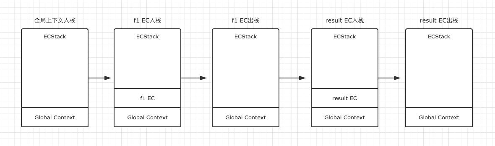

# JS基础知识
## 1	变量类型和计算	
### 1.1	值类型和引用类型的区别？	
1. 值类型：每个变量都会存储各自的值。不会相互影响
2. 引用类型：不同变量的指针执行了同一个对象（数组，对象，函数）

### 1.2	typeof可以及检测的数据类型有哪些？
> [!NOTE] 
> - 基本数据类型：Undefined null bool string number
> - 关键点：typeof只能区分值类型，不能区分引用类型
1. JS中的基本数据类型：null, undefined, bool, string, number（typeof可以区分除了null以外的四种值类型）
2. typeof 6种类型：Object({},[],null), Undefined, Boolean, Number, Function, String
3. typeof可以区分值类型，typeof null = Object

### 1.3	JS中===和==的区别？
#### 1.3.1 区别?
== 会进行强制类型转换之后再比较，=== 不会进行强制类型转换的

#### 1.3.2 应用场景?
1. （用于判断对象属性是否存在）：if (obj == null)  ===>>>  等价于if (obj == null || obj == undefined),可以简化代码，其他情形都使用===进行比较
2. 用于判断函数的参数是否存在： function(a, b){ if(a == null) { // ... }}
3. 对于函数内部或者是一个对象的参数进行判断只会出现undefined， 而不会报错（慎用）
   
#### 1.3.3 其他?
js中类型转换为false的有哪些(6种)：null, undefined, NaN, '', false, 0
	
## 1.4	JS中的内置函数有哪些？
> [!NOTE]	
> - 内置函数： Object  Array Boolean Number String Function Date RegExp Error
> - 内置对象：Math, JSON

## 2 原型和原型链	
### 2.1	原型链的5条规则	
1. 所有的引用类型（数组，对象，函数），都是具有对象特性的，即可以自由扩展属性（除了null以外）
2. 所有的引用类型（数组、对象、函数），都有一个__proto__ 属性（隐式原型），这个属性的值是一个普通对象
3. 所有的函数，都有一个prototype属性（显式原型），这个属性值是一个普通的对象
4. 所有的引用类型（数组、对象、函数），__proto__的属性值指向（完全相等）它的构造函数的“prototype”的属性值
5. 当试图得到一个对象的某一个属性的时候，如果一个对象本身没有这个属性的话，就会去它的__proto__( 也就是它的构造函数中去寻找这个属性)

### 2.2	JS中寻找对象属性的过程	
1. 当一个对象没有这个toString()这个属性的时候，就回去自己的隐式原型__proto__中去寻找这个属性，也就是去自己额构造函数的显示原型prototype中寻找这个属性（对象自身的隐式原型就是他的构造函数的显式原型）
2. 发现FOO.prototype中也没有这个toString属性，这也是一个对象，name就去这个对象{}的__proto__中寻找toString()这个属性

### 2.3	instanceof的作用？
> 是用于判断【引用类型】属于哪个【构造函数】的方法
> [!NOTE]
> 总结：f.__proto__ 一层一层向上寻找，能否找到FOO.prototype，找到为true，否则为false
	
### 2.4	写一个原型继承的例子
```js
/**
     * 动物类
     * @constructor
     * */
    function Animal (name){
        this.name = name;
        this.eat = function () {
            console.log('My name is ', name, ' I am eating Foods…………');
        }
    }

    /**
     * 小狗类
     * @constructor
     */
    function Dog(){
        this.bark = function () {
            console.log("I am a dog, I am barking……");
        }
    }

    // 如何让这个小狗继承这个Animal的属性呢？
    // 实现思路：每一个函数都有一个prototype属性，这个属性值是一个普通的对象
    Dog.prototype = new Animal();
    var dog = new Dog();
    // 这个小狗有eat() 这个属性吗？发现自身没有，那么就会去dog这个对象的__proto__里面去寻找，也就是他的构造函数Dog的prototype上面去寻找
    // 发现这个对象Dog构造函数的prototype的值是一个对象new Animal(), 这个对象里面是有eat这个属性的，因此就找到了
    dog.eat(); // My name is  undefined  I am eating Foods…………
    console.log(dog.__proto__ === Dog.prototype);       // tru
```	
### 2.5	描述一下new一个对象的过程
> [!NOTE]	
> 1. 创建一个新对象
> 2. this指向这个新对象
> 3. 执行代码（对this赋值）
> 4. 返回this

```js
  // v1
  function objectFactory() {
      var obj = new Object(),
          // 因为 shift 会修改原数组，所以 arguments 会被去除第一个参数
          Constructor = [].shift.call(arguments);     // 拿到伪数组中的第一个参数
      // 取出参数中的第一个参数，就是我们要传入的构造函数，建立继承关系
      obj.__proto__ = Constructor.prototype;
      Constructor.apply(obj, arguments);
      return obj;
  }

  // v2 : 还需要判断返回的值是不是一个对象，如果是一个对象，我们就返回这个对象，如果没有，我们该返回什么就返回什么。
  function objectFactory() {
      var obj = new Object(),
          Constructor = [].shift.call(arguments);
      // 建立继承关系(二者之间的关系)
      obj.__proto__ = Constructor.prototype;
      // 开始执行这个构造函数
      var ret = Constructor.apply(obj, arguments);
      // 看一下构造函数的返回值，是对象还是一个基本数据类型?
      return typeof ret === 'object' ? ret : obj;
  }

 
  // v4：Object.create的原理
    // var obj = Object.create(Constructor.prototype);
    // 等价于：
    // var obj = new Object();
    // obj.__proto__ = Constructor.prototype;
    const _new = function () {
        var Constructor = [].shift.call(arguments);
        // 1. 创建一个对象，这个对象要继承与构造函数的原型对象
        var obj = Object.create(Constructor.prototype);
        // 2. 执行这个构造函数
        var ret = Constructor.apply(obj, arguments);
        return typeof ret === 'object' ? ret || obj : obj;
    }
    
    // v5: 实现一个自己的new构造函数
    const _new = function() {
        // 从Object.prototype上克隆一个对象 
        var obj = new Object();
        // 取出来外部传入的构造器
        var Constructor = [].shift.call(arguments);
        
        // 使用一个中间的函数来维护原型的关系
        var F = function(){};
        F.prototype = Constructor.prototype;
        obj = new F();
        
        // 开始执行这个构造函数
        var res = Constructor.apply(obj, arguments);
        // 确保构造器总是返回一个对象(使用res || obj 的方式来防止返回null参数)
        return typeof res === 'object' ? res || obj : obj;
    }
```

### 2.6	zepto或其他框架中是如何实现原型链的？
```js
var Zepto = (function(){
    var $,
        zepto = {}
    
    // ...省略N行代码...

    zepto.Z = function(dom, selector) {
      dom = dom || []
      dom.__proto__ = $.fn
      dom.selector = selector || ''
      return dom
    }
    
    zepto.init = function(selector, context) {
        var dom
        
        // 针对参数情况，分别对dom赋值
        
        // 最终调用 zepto.Z 返回的数据
        return zepto.Z(dom, selector)
    }
    
    $ = function(selector, context){
        return zepto.init(selector, context)
    }
    
    $.fn = {
        // 里面有若干个工具函数
    }
    
    // ...省略N行代码...
    
    return $
})()

window.Zepto = Zepto
window.$ === undefined && (window.$ = Zepto)
```	
## 3	作用域和闭包	
### 3.1	函数表达式和函数声明的区别？	
1. 函数声明中函数名是必须的，函数表达式中则是可选的。
2. 用函数声明定义的函数，函数可以在函数声明之前调用，而用函数表达式定义的函数则只能在声明之后调用。

```js
var handsome='handsome';
function handsomeToUgly(){
    alert(handsome);
    var handsome='ugly';
    alert(handsome);
}
handsomeToUgly();

// 正常的解析编译流程如下：
var handsome='handsome';
function handsomeToUgly(){
    var handsome;
    alert(handsome);
    var handsome='ugly';
    alert(handsome);
}
handsomeToUgly();
```

> [!NOTE]
> 总结：（ 根本原因在于解析器对于这两种定义方式读取的顺序不同：解析器会实现读取函数声明，即函数声明放在任意位置都可以被调用；而对于函数表达式，解析器只有在读到函数表达式所在那一行时才会开始执行）

### 3.2	对执行上下文的理解？

> [!NOTE]
> 执行上下文可以理解为当前代码的执行环境，它会形成一个作用域。JavaScript中的运行环境大概包括三种情况。

+ a. 全局环境：JavaScript代码运行起来会首先进入的环境

+ b. 函数环境：当函数被调用执行时，会进入被调用的函数中执行代码

+ c. eval（不推荐使用会对JS的执行效率产生影响）

因此在一个JavaScript程序中，必定会产生多个执行上下文，JavaScript引擎会以栈的方式来处理它们，这个栈，我们称其为函数调用栈(call stack)。栈底永远都是全局上下文，而栈顶就是当前正在执行的上下文。当代码在执行过程中，遇到以上三种情况，都会生成一个执行上下文，放入栈中，而处于栈顶的上下文执行完毕之后，就会自动出栈。

```js
function f1(){
    var n=999;
    function f2(){
        alert(n);
    }
    return f2;
}
var result=f1();
result(); // 999
```	
上面代码函数调用栈的过程：

参考：https://www.cnblogs.com/ashen137/p/11422136.html

### 3.3	对this的理解？
1. 作为构造函数执行
2. 作为对象属性执行
3. 作为普通函数执行
4. call apply bind

#### 3.3.1 setTimeout、setInterval中的this
```js
var obj ={ 
    fn:function(){
        console.log(this);
    }
}
function fn2(){
    console.log(this);
}
setTimeout(obj.fn, 0);   //Window
setTimeout(fn2, 0);//Window
setInterval( obj.fn,1000 );//Window
```
从上述例子中可以看到setTimeout,setInterval中函数内的this是指向了window对象，这是由于setTimeout()，setInterval()调用的代码运行在与所在函数完全分离的执行环境上。这会导致这些代码中包含的 this 关键字会指向 window (或全局)对象。

### 3.3.2 严格模式下的this
#### （1）全局作用域中的this
```js
"use strict"
console.log("this === window",this === window);   //true
```
在严格模式下的全局作用域中 this 指向window对象

#### （2）全局作用域中函数中的this
```js
"use strict"
function fn(){
    console.log('fn的this:'+this);
    function fn2(){
        console.log('fn2的this:'+this);
    }
    fn2();    
}
fn();

// fn的this:undefined
// fn2的this:undefined
```
严格模式下： 在全局作用域中函数的 this 指向 undefined

#### （3）对象的方法中的this
```js
"use strict"
let name = 'zhaosi';
let obj = {
    name: 'liuneng',
    fn:function(){
        console.log(this.name)
        console.log(this);
    }
}
obj.fn();
//  liuneng
// {name: "liuneng", fn: ƒ}
```
严格模式下，对象的函数中的this指向该对象

#### （4）构造函数中的this
```js
"use strict"
function Person( name){
    this.name = name;
    this.say = function(){
        console.log('my name is:'+this.name);
        console.log(this);
    }
}
var lzx = new Person('lzx');
lzx.say();  
//my name is lzx
//Person { name:"lzx", say:f } 
```
严格模式下，构造函数中的this指向new出来的对象

#### （5）事件处理函数中的this
```js
"use strict"
var oBtn = document.getElementById("btn");
oBtn.onclick = fn;
function fn(){
    console.log(this);
}
//<button id="btn">点击</button>
```
### 3.3.3 箭头函数中的this
首先，箭头函数没有自己的this，箭头函数中的this是在定义函数的时候绑定，它会捕获其所在的上下文的this作为自己的this，而不像普通函数那样是在执行函数的时候绑定。
```js
 var a = 10;
var obj = {
    a: 99,
    fn1:()=>{ console.log(this.a) },
    fn2:function(){ console.log(this.a) }
}
obj.fn1(); //10
obj.fn2(); //99
```
箭头函数this指向它定义时的上下文（在这里是window），而普通函数的this则指向调用它的对象
参考博文：https://blog.csdn.net/lizhengxv/article/details/84639342

### 3.4	call,apply,bind的区别	
#### 3.4.1 相同点
 三个函数都会改变this的指向（调用这三个函数的函数内部的this）

#### 3.4.2 不同点
 1)、bind会产生新的函数，（把对象和函数绑定死后，产生新的函数）

 2)、call和apply不会产生新的函数，只是在调用时，绑定一下而已。

 3)、call和apply的区别，第一个参数都是要绑定的this，apply第二个参数是数组（是函数的所有参数），call把apply的第二个参数单列出来。

### 3.5	对JS中作用域的理解？	
> [!NOTE]
> 注意点：JS是没有块级作用域的，只有函数和全局作用域

### 3.6	什么是自由变量和作用域链？	
> [!NOTE]
> 自由变量：当前作用域没有定义的变量，就是‘自由变量’, 这里的变量是一个aaaaa，发现这个函数作用域里面没有定义这个变量，就开始去父级作用域中寻找aaaaa这个变量（全局作用域中），发现还是没有找到这个变量的定义， 最终就会报错。

> 作用域链：实际上就是函数作用域中没有定义的变量，会去它的父级作用域中寻找的过程。

```js
// 实际开发中闭包的应用场景（判断用户传递的参数是否已经传递过来）
// 闭包主要应用于封装变量，收敛权限
function isFirstLoad() {
    // 这里的目的实际上就是把_list 封装为一个变量（自由变量）
    // 防止暴露为一个全局变量，外部无法拿到这个变量，外部是无法修改的，从而达到了一个封装变量的作用
    var _list = [];
    return function (id) {
        // _list 就是一个自由变量，而且全局只有这一个（函数作用域范围中这一个）
        if (_list.indexOf(id) >= 0)
            return false;
        else
            _list.push(id);
        return true;
    }
}
```
### 3.7	闭包的使用场景有哪些？	
#### 3.7.1	函数作为返回值
一个函数的返回值是一个函数，父级作用域是指，定义时候的作用域，而不是执行的作用域
#### 3.7.2 函数作为参数传递
【重点】：函数作用域中的自由变量会在声明的父级作用域中去寻找，而不是去执行的时候的作用域中去寻找变量

### 3.8	创建10个a标签，点击的时候，弹出对应的序号	
```js
// 使用立即函数+闭包实现的
function createHrefElementsTwo() {
    for (var i = 0; i < 10; i++) {
        // 一个函数就是一个作用域，这里相当于是创建了10个函数作用域，每一个作用域里面都是有自己的一歌变量i的，这是当用户需要这个自由变量的时候，
        // 就会直接去这个这个函数作用域范围内寻找这个变量，每一个里面就是一个单独的函数作用域
        (function (i) {
            // 这里面的就是单独的一个函数作用域
            var a = document.createElement('a');
            a.innerText = '我是立即函数中的' + i;
            a.href = '#'
            a.addEventListener('click', function (e) {
                e.preventDefault();
                // 分析：由这个for循环可以发现，这个i实际上是一个函数作用域的变量，这个i一直是变化的，当i等于9的时候，创建完毕最后一个元素，
                // 最后执行完毕i++, i的最终结果就是10，因此对于每一个a标签点击都是一个10
                alert(i);                   // 这里的i最后可以实现点击就弹出对应的编号吗？
            })
            document.body.appendChild(a);
            document.body.appendChild(document.createElement('br'));
        })(i);      //  这里的i和这个里面的状态信息保持一致的
    }
}

```
### 3.9	对函数curry化的理解？	
> 需求：要实现一个这样的加法函数，使得：add(1,2,3)(1)(2)(3)(4,5,6)(7,8)() === 42
> - 分析这个函数的特点: 当这个函数有参数的时候，返回的是一个函数
> - 如果没有参数的时候，就会去执行这个函数，得到计算的结果

```js
// 1. 函数curry化的实现：console.log(add(1, 2, 3)(1)(2)(3)(4, 5, 6)(7, 8)());//42
    function add() {
        // 思路：当传递参数的时候，开始计算；没有参数的时候，返回计算结果
        let _list = [];
        _list = _list.concat([].slice.call(arguments))
        return function () {
            let args = [].slice.call(arguments),
                len = args.length;
            // 这里也是需要接受参数的
            if (len !== 0) {
                // 说明用户又传递参数进来了
                // this.callee();
                // 把每次传递的数字全局记录下来
                _list = _list.concat(args);

                // 继续回调，返回一个函数
                // 这里返回一个函数(这里也是可以直接返回一个函数表达式的引用的)
                return arguments.callee;
            } else {
                // 开始遍历数组，计算结果, reduce 返回的也是一个最终的计算结果
                return _list.reduce((a, b) => {
                    return a + b
                })
            }
        }
    }

// 测试：
console.log(add(1, 2, 3)(1)(2)(3)(4, 5, 6)(7, 8)());

```
### 3.10	如何实现一个bind函数？	
```js
Function.prototype._bind = function () {
        // 思路：bind函数实际上每次返回的是一个函数
        // bind 函数的第一个参数是this的指向，其他参数是传递的参数
        // 1. 接受参数，解析this和args
        let _bindthis = arguments[0],
            _self = this,
            _args = [].slice.call(arguments).shift();        // 删除第0个元素之后剩余的元素数组


        return function () {
            // 处理用户传递的参数,arguments 就是用户传递给我的函数参数
            let args = arguments;
            console.log('用户传递的函数参数', args);
            // 修改this的指向, 没有修改之前，由于bind这个函数是fn调用的，因此this指向的是fn
            _self.apply(_bindthis, [].slice.call(args).concat(_args));
        }
    }
// 测试：
// 实际上第一个调用的函数参数在第二个函数参数也是可以直接一起使用的
    console.log(minus._bind({name: 'zhangsan'}, 2)(7, 8));

```

## 4	异步和单线程	
### 4.1	什么是异步？前端使用异步的场景有哪些？
```js
console.log(100);
setTimeout(function () {            
    // 异步执行的代码不会阻塞下面代码的执行
        console.log(200);
}, 1000)
console.log(300);


// 上面的代码执行流程如下：
// 1. 执行第一行，输出100；
// 2. 执行setTimeout函数后，传入setTimeout里面的函数function(){console.log(200)}会被暂存起来（放入到事件队列里面），
//    不会立即执行该函数（单线程的特点，不会立即干两件事）；
// 3. 执行最后一行代码，输出100；
// 4. 等待所有的同步代码执行完毕之后，处于空闲状态的时候，会从事件队列中取出之前暂存的函数；
// 5. 发现暂存起来的setTimeout中的暂存函数，需要等待1s之后才会执行，该函数就会等待1s之后才会执行
// 使用异步的场景：
// 1. 定时任务： setTimeout, setInterval
// 2. 网络请求： ajax请求, 动态加载
// 3. 事件绑定
// 同步和异步的区别：
// 同步会【阻塞】代码的执行，异步不会；alert是一个同步的例子，setTimeout是一个异步的例子

```	

### 4.2	如何实现一个自己的ajax？
```js
// 创建对象
    var xhr = new XMLHttpRequest();
    // 打开连接GET请求，请求地址，是否同步
    xhr.open('GET', '/JS-Professional/data.json', false);
    xhr.onreadyStateChange = function () {
// readyState状态码：
        // 0- （未初始化）：还没有调用send（）方法
        // 1- （载入）：已经调用send（）方法，正在发送请求
        // 2- （载入完成）：send（）方法执行完成，已经接收到全部响应内容
        // 3. （交互）正在解析响应的内容
        // 4. （完成）响应内容解析完成，可以在客户端调用了
   
        // 2** - 表示成功处理请求，如200
        // 3** - 需要重定向，浏览器直接跳转，如301
        // 4** - 客户端请求错误，如404
        // 5** - 服务端错误，如500

        if (xhr.readyState === 4){
            //  此时表示请求已经发送成功(已经接受到服务端返回的信息)
            if (xhr.status === 200){
                console.log('请求发送成功', xhr.responseText)
            }
        }
    }
    xhr.send(null);

```	

## 5	其他知识点	
### 5.1	如何获取2017-06-10 格式的日期？	
```js
function formatDate(date) {
        var dt = date || new Date(),
            year = dt.getFullYear(),
            month = (dt.getMonth() + 1).toString(),
            day = dt.getDate().toString();
        month = month.length === 1 ? '0' + month : month;
        day = day.length === 1 ? '0' + day : day;
        return year + '-' + month + '-' + day;
    }
// 注意点：月是从0开始计数的

```
### 5.2	如何获取一个长度一致的随机字符串？
> [!NOTE]
> 思路：使用一个长度固定的字符串，如“00000000”作为后缀，然后进行字符串截取。
```js
// 获取一个长度一致的字符串的随机数字
function randomStr(str) {
    var random = str || Math.random();
    random = random + '0000000000';     // 小技巧：防止程序报错
    random = random.slice(0, 10);
    return random;
}
randomStr();
```	

### 5.3	写一个能遍历对象和数组通用的forEach函数
```js
function forEach(obj, fn) {
        if (typeof obj === 'object') {
            // 对象遍历
            for (var key in obj) {
                // console.log(key, obj[key]);
                // 这里只去输出自己的属性，原型链上面的属性信息不用管（继承父类的属性信息是不会输出的）
                if (obj.hasOwnProperty(key))
                    fn(key, obj[key]);          // 直接执行这个函数
            }
        } else if (obj instanceof Array) {
            // 数组遍历
            obj.forEach(function (item, index) {
                fn(index, item);
            })
        }
    }

```	
### 5.4	数组中常用的方法有哪些？	
1. forEach 遍历所有的元素
2. every 判断所有的元素是否都符合条件
3. some 判断是否至少有一个元素符合条件
4. sort 排序
5. map 对数组中的元素重新组装，生成一个新的数组
6. filter 过滤符合条件的元素

> [!WARNING]
> **注意点**:splice,concat,sprt是直接在原地操作数组的。
