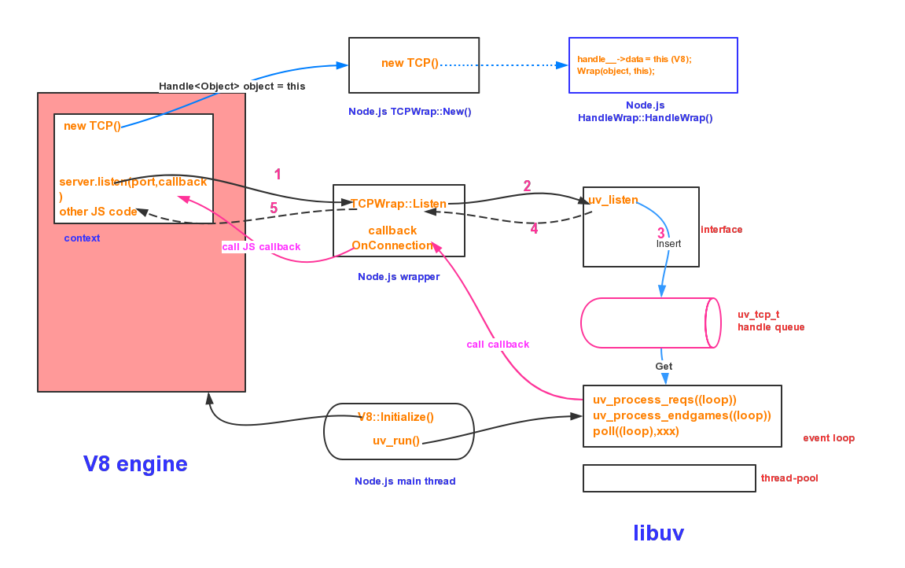

# NodeJS基础知识
## 1. Node的全局对象和全局变量
### 1.1 全局对象：所有模块都可以调用的
1. global：表示Node所在的全局环境，类似于浏览器的window对象。

2. process：该对象表示Node所处的当前进程，允许开发者与该进程互动。

3. console：指向Node内置的console模块，提供命令行环境中的标准输入、标准输出功能。

### 1.2 全局函数
1. 定时器函数：共有4个，分别是setTimeout(), clearTimeout(), setInterval(), clearInterval()；
2. require：用于加载模块；
3. Buffer()：用于操作二进制数据。

### 1.3 全局变量
1. __filename：指向当前运行的脚本文件名。
2. __dirname：指向当前运行的脚本所在的目录。

## 2. Node的三大特点
### 2.1 单线程
    Node.js不为每个客户连接创建一个新的线程，而仅仅使用一个线程。当有用户连接了，就触发一个内部事件，通过非阻塞I/O、事件驱动机制，让Node.js程序宏观上也是并行的。
        

### 2.2 非阻塞I/O  

1. 由于Node.js中采用了非阻塞型I/O机制，因此在执行了访问数据库的代码之后，将立即转而执行其后面的代码，把数据库返回结果的处理代码放在回调函数中，从而提高了程序的执行效率。

2. 当某个I/O执行完毕时，将以事件的形式通知执行I/O操作的线程，线程执行这个事件的回调函数。为了处理异步I/O，线程必须有事件循环，不断的检查有没有未处理的事件，依次予以处理。

3. 阻塞模式下，一个线程只能处理一项任务，要想提高吞吐量必须通过多线程。而非阻塞模式下，一个线程永远在执行计算操作，这个线程的CPU核心利用率永远是100%。所以，这是一种特别有哲理的解决方案：与其人多，但是好多人闲着；还不如一个人玩命，往死里干活儿。

### 2.3 事件驱动event-driven

1. 在Node中，在一个时刻，只能执行一个事件回调函数，但是在执行一个事件回调函数的中途，可以转而处理其他事件（比如，又有新用户连接了），然后返回继续执行原事件的回调函数，这种处理机制，称为“事件环”机制。

2. Node.js底层是C++（V8也是C++写的）。底层代码中，近半数都用于事件队列、回调函数队列的构建。

## 3. Node技术架构
### 3.1 Node底层架构
> nodejs组成部分：v8 engine, libuv, builtin modules, native modules以及其他辅助服务。

+ v8 engine：主要有两个作用 
    1.虚拟机的功能，执行js代码（自己的代码，第三方的代码和native modules的代码）。
    2.提供C++函数接口，为nodejs提供v8初始化，创建context，scope等。

+ libuv：它是基于事件驱动的异步IO模型库，我们的js代码发出请求，最终由libuv完成，而我们所设置的回调函数则是在libuv触发。

+ builtin modules：它是由C++代码写成各类模块，包含了crypto，zlib, file stream etc 基础功能。（v8提供了函数接口，libuv提供异步IO模型库，以及一些nodejs函数，为builtin modules提供服务）。

+ native modules：它是由js写成，提供我们应用程序调用的库，同时这些模块又依赖builtin modules来获取相应的服务支持

> [!NOTE]
> 总结：如果把nodejs看做一个黑匣子，起暴露给开发者的接口则是native modules，当我们发起请求时，请求自上而下，穿越native modules，通过builtin modules将请求传送至v8，libuv和其他辅助服务，请求结束，则从下回溯至上，最终调用我们的回调函数。

### 3.2 Node函数调用机制

1. v8执行js代码 server.listen()时，会通过一些基础服务到TCPWrap::listen(),TCPWrap是nodejs的內建模块，其通过libuv的api uv_listen()的方式，由libuv来完成异步调用。

2. 图中1,2,3,4,5步骤标明了调用和返回的路径，这几步很快结束，留下callback TCPWrap::OnConnection()等着所需要的数据准备好后被调用。

3. libuv在得到所需要的请求后，会调用callback TCPWrap::OnConnection()，在该函数最后通过 tcp_wrap->MakeCallback(env->onconnection_string(), ARRAY_SIZE(argv), argv) 调用V8 engine中的JavaScript callback。

4. Node.js内建模块http其实是建立在模块net之上的。如果看net.js代码会发现，其通过 new TCP() 返回的类对象完成后续的TCP connect, bind, open等socket动作。

5. 可以看到Node.js做的工作像是一座桥。左手V8，右手libuv，将2者有机连接在一起。例如HandleWrap::HandleWrap()中记录了V8 instance中的JavaScript对象以及TCPWrap对象。这样在TCPWrap::OnConnection()中可以拿到这两个对象，执行后续的callback调用。

---
**参考文章**
- https://www.cnblogs.com/peiyu1988/p/8192066.html
