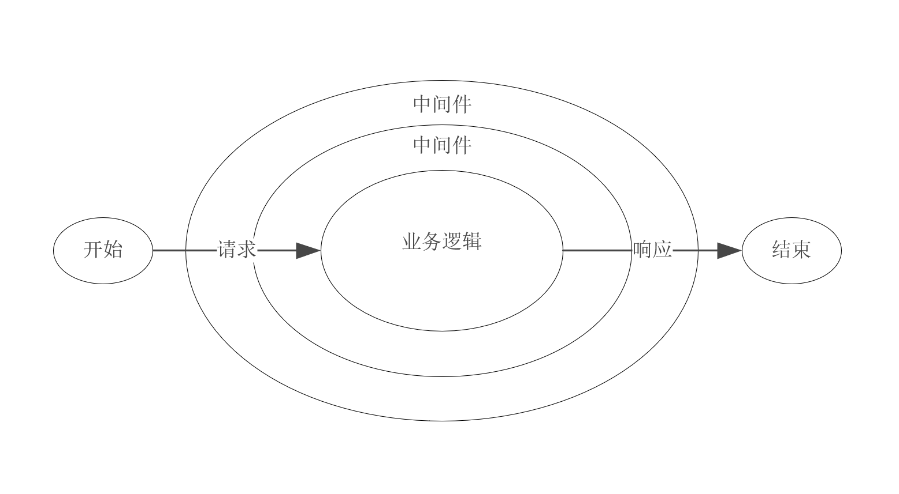
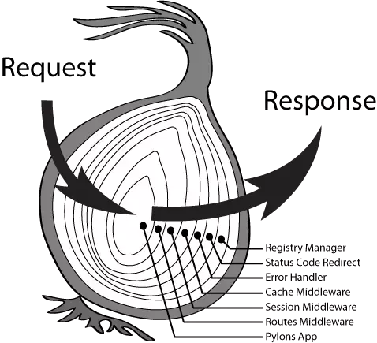

# NOdeJS 中间件

## 1. 中间件到底是个什么东西呢？
> [!NOTE]
> 中间件其是一个函数，在响应发送之前对请求进行一些操作



```js
    function middleware(req,res,next){
        // 做该干的事
    
        // 做完后调用下一个函数
        next();
    }
```
这个函数有些不太一样，它还有一个next参数，而这个next也是一个函数，它表示函数数组中的下一个函数

## 2. 函数数组又是什么呢?
> [!NOTE]
> express内部维护一个函数数组，这个函数数组表示在发出响应之前要执行的所有函数，也就是中间件数组

使用app.use(fn)后，传进来的fn就会被扔到这个数组里，执行完毕后调用next()方法执行函数数组里的下一个函数，如果没有调用next()的话，就不会调用下一个函数了，也就是说调用就会被终止

## 3. 如何实现一个中间件呢？
```js
    function express() {
      // 函数数组用于存放所有的中间件函数
      let fns = [];
      
      let app = function(req, res) {
        let i = 0;
        
        function next() {
          // 取出数组中的下一个函数
          let task = fns[i++];
          // 如果函数存在的u啊
          if (task) {
              // 就先去执行这个用户自定义的函数里面的业务逻辑(每次把当前的next继续向后传递)
              task(req, res, next);
          }
        }
        
        // 用户首次调用的执行第一个
        next();
      }
      
      // 使用use的时候就把用户指定的这个函数放入到一个函数数组里面去
      app.use = function(task) {
        fns.push(task);
      }
      
      return app;
    }
```


## 4. 模拟实现一个异步按顺序执行的函数？（面试重点）
```js
    function fn1(next) {
      next();
    }
    
    function fn2(next) {
      next();
    }
    
    function fn3(next) {
      next();
    }
    
    
    // 类似于一个异步的迭代器
    function nextRegister(...tasks) {
      let i = 0;
      
      
      function next() {
        let task = tasks[i];
        if (!task || typeof task !== 'function') {
            return ;
        }
        task(next);
      }
      
      // 第一次调用
      next();
    }
    
    // 开始注册三个异步函数
    nextRegister(fn1, fn2, fn3);
```


## 5. 描述一下express或者koa的技术架构？
> [!NOTE]
> 关键在于解释清楚对路由中间件的理解，可以以koa的洋葱模型讲解为例。

