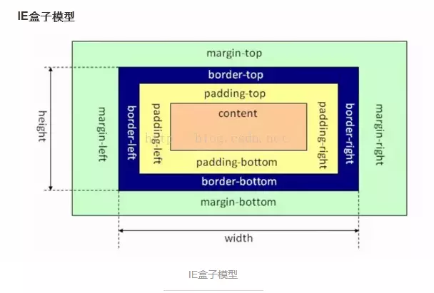

# CSS效果
## 1.使用div绘制图形（三角形）？
```html
<!DOCTYPE html>
<html lang="en">
<head>
    <meta charset="UTF-8">
    <title>Title</title>
    <style>
        .triangle-top {
            width: 0;
            height: 0;
            border-width: 0 40px 40px;
            border-style: solid;
            border-color: transparent transparent red;
        }

        .triangle-bottom {
            width: 0;
            height: 0;
            border-style: solid;
            border-width: 40px 40px 0 40px;
            border-color: blueviolet transparent transparent transparent;
        }

        .triangle-left {
            width: 0;
            height: 0;
            border-style: solid;
            border-width: 40px 0 40px 40px;
            border-color: transparent transparent transparent #89ff56;
        }

        .triangle-right {
            width: 0;
            height: 0;
            border-style: solid;
            border-width: 40px 40px 40px 0;
            border-color: transparent yellowgreen transparent;
        }


        /*缺口的三角形*/
        .box{
            position: absolute;
            left: 0;
            top: 0;
            width: 0;
            height:0;
            border: 6px solid transparent;
        }
        .b1{
            /*底层的盒子三角形相当于全部是黑色的*/
            border-bottom-color:#000 ;
        }
        .b2{
            /*上层的为白色覆盖*/
            border-bottom-color:#fff ;
        }
    </style>
</head>
<body>

<div class="triangle-top"></div>
<div class="triangle-bottom"></div>
<div class="triangle-left"></div>
<div class="triangle-right"></div>

<div class="box b1"></div>
<div class="box b2"></div>
</body>
</html>
```

## 2.如何产生一个不占空间的边框?( box-sizing属性)?
> [!NOTE]
> 知识点：IE和标准盒子模型的异同点
> 
+ 标准盒子模型：元素的width或height=content的width或height；

> 
+ IE盒子模型：元素的width或height=content的width或height+padding*2+border*2；

```css
    /*IE盒子模型：width_sum = margin + width*/
    .border-box-use {
        box-sizing : border-box;
        /*通过IE的盒子模型设置出来之后，这个盒子内容区域的宽度实际只有180px
            这里指定的width 实际上是包含了border的宽度的
        */
        width: 200px;
        height: 200px;

        border: 10px solid #89ff56;
    }

    /*标准盒子模型：width_sum = margin + width + padding + width*/
    .border-content-box-use {
        /*设置为标准的盒子模型，默认值*/
        box-sizing: content-box;

        width: 200px;
        height: 200px;

        padding: 1px;
        border: 10px solid #ff255f;
    }

    .parent-box-inhrit {
        /*设置当前的盒子模型是从父级盒子中继承，这里相当于是继承了IE的盒子模型*/
        box-sizing: inherit;
        width: 50px;
        height: 50px;
        background-color: #48adff;

        border: 1px solid #000;

        /*对一个元素自身设置padding，相当于是把盒子撑大了*/
        padding: 5px;
    }
```
### 2.1 使用box-shadow实现
```css
/*box-shadow 制作边框*/
.box-shadow-border {
    width: 200px;
    height: 200px;
    /*设置外阴影：x y 模糊区域 扩展区域*/
    box-shadow: 0 0 0 10px red , 0 0 0 10px blue;
}
```
### 2.2 使用outline实现
在元素边框边缘的外围绘制一条包围元素的线，包括outline-color、outline-style、outline-width三个子属性的设置，可缺省，无固定顺序。轮廓不占据页面空间，也不一定是矩形。即不会增加额外的width或者height。
```css
.borner-no-space {
    width: 200px;
    height: 200px;
    outline: 10px solid red;
}
```
## 3.如何实现IOS图标的圆角？
```css
/*clip-path的使用
            1. 对容器进行裁剪
            2. 常见集合图形
            3. 自定义路径
*/
.container-clippath {
    width: 400px;
    height: 300px;
    border: 1px solid #000;
    background-image: url("bg.jpg");
    background-size: contain;
    background-repeat: no-repeat;
    background-position: center center;

    /*开始进行区域裁剪*/
    /*clip-path: circle(50px at 100px 100px);*/
    /*clip-path: inset(100px 50px);*/
    clip-path: polygon(50% 0%, 100% 50%, 50% 100%, 0% 50%);
    /*同时，也是支持svg矢量图的裁剪*/
}

.container-clippath:hover {
    clip-path: circle(80px at 100px 100px);
}
```

## 5.说下背景图的居中显示/重复/改变大小?
```css
background-position： 背景图片相对容器原点的起始位置
background-repeat
background-size : cover/contain(设置大小)

```

```css
/* 一个值: 这个值指定图片的宽度，那么第二个值为auto */
background-size: auto
background-size: 50%
background-size: 3em
background-size: 12px
 
/* 两个值: 第一个值指定图片的宽度，第二个值指定图片的高度 */
background-size: 50% auto
background-size: 3em 25%
background-size: auto 6px
background-size: auto auto
/*多重背景，请用逗号隔开，在CSS语法中凡语法后跟*或者#，都是可以无限重复的，但是必须用逗号隔开。 */
background-size: auto, auto     /* 不要跟background-size: auto auto混淆了 */
background-size: 50%, 25%, 25%
background-size: 6px, auto, contain
 
background-size: inherit
```

## 6.如何平移/放大一个元素？如何实现0.5px的边框？
> [!NOTE]
> 知识点:transform的灵活使用

```html
<style>
.custom-border{
    width:200px;
    margin:10px auto;
    height:100px;
    border:1px solid #333;
    background-color:#eee;
    padding:10px;
}
.scale-border{
    margin:10px auto;
    height:100px;
    position:relative;
    padding:10px;
    width: 200px;
}
.border{
    -webkit-transform:scale(0.5);
    transform:scale(0.5);
    position:absolute;
    border:1px solid #333;
    top:-50%;
    right:-50%;
    bottom:-50%;
    left:-50%;
    background-color:#eee;
}
.content{
    position:relative;
    z-index:2;
}
</style>

<body>
    <div class="custom-border border-color">边框宽度1px</div>
    <div class="scale-border">
        <div class="content">边框宽度0.5px</div>
        <div class="border border-color"></div>
    </div>
</body>
</html>
```

## 7.如何实现3D效果（旋转的硬币）？
```css
/* 1. 设置一个透视变换，相机距离图像的距离 */
/* perspective : 500px */
/* 2. 设置视觉查看的样式 */
/* transform-style : perspective-3d */
/* 3. 变换图像 */
/* transform : translate rotate */


/*旋转的硬币效果*/
.money {
    width: 100px;
    height: 100px;
    border-radius: 50px;
    background-color: #48adff;
    border: 2px solid #000;

    /*开启3D效果*/

    perspective: 500px;
    transform-style: preserve-3d;
    /*transform : rotateY(180deg);*/
    animation : rotate 2s linear infinite;
}

@keyframes rotate {
    from {
        transform : rotateY(0deg);
    }
    to {
        transform : rotateY(360deg);
    }
}
```
