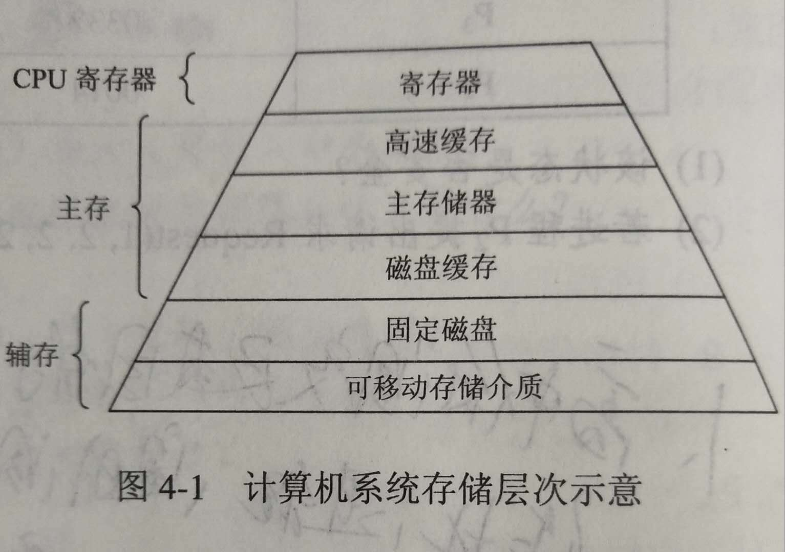
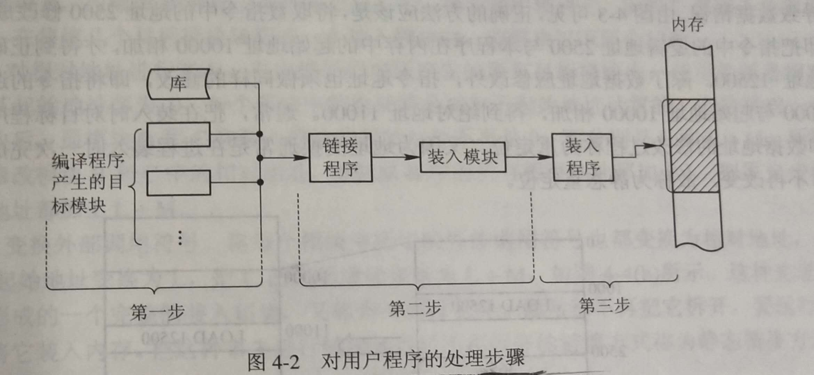

# 操作系统基础知识
## 1.操作系统分类
- 批处理操作系统（单道，多道）
- 分时操作系统（Unix）
- 实时操作系统（MsgOS）
- 网络操作系统
- 分布式操作系统
- 微机操作系统（Linux、Windows、IOS等）
- 嵌入式操作系统（Android，iOS）

## 2.操作系统的4个特征?
### 2.1 并发性
区别于并行性，并发是指：多个事件在同一时间间隔内发生，并行是指：多个事件在同一时刻发生
### 2.2 共享性
一般的共享是指某种资源可以被大家使用，在os下的资源共享称为资源复用，具体含义是：系统中的资源可供内存中多个并发的执行的进程共同使用
### 2.3 虚拟性
通过某种技术将一个物理实体变为若干个逻辑上的对应物的功能即是虚拟
### 2.4 不确定性（异步）
每道程序完成的时间都是不可预知的，进程是以人们不可预知的速度向前推进的

## 3.操作系统的功能
### 3.1 处理机管理
也称进程管理。实质上是对处理机执行时间进行管理，采用多道程序等技术将CPU的时间真正合理地分配给每个任务。主要包括进程管理、进程同步、进程通信和进程调度。
### 3.2 文件管理
又称信息管理。主要包括文件存储空间管理、目录管理、文件的读写管理和存取管理。
### 3.3 存储管理
是对主存储器空间的管理。主要包括存储分配与回收、存储保护、地址映射（变换）和主存扩充。（即内存管理）
### 3.4 设备管理
实质上是对硬件设备进行管理，其中包括输入输出设备的分配、启动、完成和回收。
### 3.5 作业管理
包括人物、人机交互和用户界面管理等。

## 4.处理机管理
### 4.1 线程与进程
#### 4.1.1 基本概念
> [!NOTE]
> 
  1. 进程是具有一定独立功能的程序关于某个数据集合上的一次运行活动，是系统进行资源分配和调度的一个独立单位。

  2. 线程是进程的一个实体，是CPU调度和分派的基本单位，它是比进程更小的能独立运行的基本单位。线程自己基本上不拥有系统资源，只拥有一点在运行中必不可少的资源(如程序计数器，一组寄存器和栈)，但是它可与同属一个进程的其他的线程共享进程所拥有的全部资源。也有就绪、运行、阻塞三态。

> PCB：为了便于系统描述和管理进程，在OS的核心位每个进程专门定义了一个数据结构，进程控制块PCB。PCB是进程的唯一标志

一个线程可以创建和撤销另一个线程;同一个进程中的多个线程之间可以并发执行。相对进程而言，线程是一个更加接近于执行体的概念，它可以与同进程中的其他线程共享数据，但拥有自己的栈空间，拥有独立的执行序列。

#### 4.1.2 区别

- 1) 简而言之,一个程序至少有一个进程,一个进程至少有一个线程.
- 2) 线程的划分尺度小于进程，使得多线程程序的并发性高。
- 3) 另外，进程在执行过程中拥有独立的内存单元，而多个线程共享内存，从而极大地提高了程序的运行效率。
- 4) 线程在执行过程中与进程还是有区别的。每个独立的线程有一个程序运行的入口、顺序执行序列和程序的出口。但是线程不能够独立执行，必须依存在应用程序中，由应用程序提供多个线程执行控制。
- 5) 从逻辑角度来看，多线程的意义在于一个应用程序中，有多个执行部分可以同时执行。但操作系统并没有将多个线程看做多个独立的应用，来实现进程的调度和管理以及资源分配。这就是进程和线程的重要区别。

#### 4.1.3 优缺点
> [!NOTE]
> 线程执行开销小，但不利于资源的管理和保护；而进程正相反。同时，线程适合于在SMP机器上运行，而进程则可以跨机器迁移。

### 4.2 程序顺序执行的特征
- 顺序性：每一操作必须在下一操作开始之前结束
- 封闭性：程序运行时独占全机资源，资源的状态（除初始状态外）只有本程序才能改变，程序一旦执行，其结果不受外界影响
- 可再现性：程序执行环境和初始条件相同，重复执行时，结果相同

### 4.3 程序并发执行的特征

- 间断性：程序并发运行时，共享系统资源，为完成同一任务相互合作，会形成相互制约关系，导致并发程序具有“执行-暂停-执行”这种间断性的活动规律
- 失去封闭性：程序并发执行时，资源状态由多个程序改变，某程序执行时，会受到其他程序影响，失去封闭性
- 不可再现性：失去封闭性，导致失去可再现性

### 4.4 进程的特征

- 结构特征：程序段、相关数据段和PCB三部分构成进程实体
- 动态性：进程实体的一次执行过程，具有生命期，而程序是有序指令集合，是静态的
- 并发性：多个进程同时存于内存，在一段时间内同时运行
- 独立性：进程实体是一个能独立运行、独立分配资源和独立接受调度的基本单位
- 异步性：进程按各自独立的、不可预知的速度向前推进

### 4.5 进程的状态
三态模型（左图）、五态模型（右图）

### 4.6 进程间的通信（同步与互斥）
> [!NOTE]
> 由于多个进程可以并发执行，所以进程间必然存在资源共享和相互合作的问题。进程通信是指各个进程交换信息的过程。

同步是合作进程间直接制约问题，互斥是申请临界资源进程间的间接制约问题。（临界资源（Critical Resource, CR）：在同一时间只能供一个进程使用的资源，例如：打印机，磁带机等硬件资源）

#### 4.6.1 临界区管理4条原则
（临界区：每个进程中访问临界资源的那段代码）
1. 有空即进：
2. 无空则等：
3. 有限等待：要求访问临界区的进程，保证有限时间内进入临界区，避免死等
4. 让权等待：进程不能进入临界区时，应立即释放处理机，避免忙等

### 4.7 信号量机制
即利用PV操作来对信号量进行处理。

> [!NOTE]
> 信号量（semaphore）的数据结构为一个值和一个指针，指针指向等待该信号量的下一个进程。信号量的值与相应资源的使用情况有关。

当它的值大于0时，表示当前可用资源的数量；
当它的值小于0时，其绝对值表示等待使用该资源的进程个数。

注意，信号量的值仅能由PV操作来改变。
　
> [!NOTE]
> 一般来说，信号量S >= 0时，S表示可用资源的数量。执行一次P操作意味着请求分配一个单位资源，因此S的值减1；当S < 0时，表示已经没有可用资源，请求者必须等待别的进程释放该类资源，它才能运行下去。而执行一个V操作意味着释放一个单位资源，因此S的值加1；若S <= 0，表示有某些进程正在等待该资源，因此要唤醒一个等待状态的进程，使之运行下去。

### 4.8 进程调度
如何分配CPU。
> [!NOTE]
> 调度方法分为可剥夺和不可剥夺两种。即当有更高优先级的进程到来时，是否可以将正在运行进程的CPU分配给高优先级的进程，可以则为可剥夺，否则为不可剥夺的。

在某些操作系统中，一个作业从提交到完成需要经历高、中、低三级调度。
#### 4.8.1 高级调度
又称长调度或作业调度。它决定处于输入池中的哪个后备作业可以调入主系统做好运行的准备，成为一个或一组就绪进程。系统中一个作业（程序）只需经过一次高级调度。

#### 4.8.2 中级调度
又称短程调度或对换调度。它决定处于交换区中的就绪进程哪个可以调入内存，以便直接参与对CPU的竞争。在内存资源紧张时，为了将进程调入内存，必须将内存中处于阻塞状态的进程调出交换区，以便为调入进程腾出空间。

#### 4.8.3 低级调度
又称短程调度或进程调度。它决定处于内存中的就绪进程中的哪个可以占用CPU。最活跃、最重要的调度程序，对系统影响也是最大的。

### 4.9 常见的进程调度算法
1. 先来先服务（FCFS）
2. 短作业优先
3. 时间片轮转（固定时间片、可变时间片）
4. 优先级调度（静态优先级、动态优先级）
5. 多级反馈调度（时间片轮转+优先级调度）。

### 4.10 死锁
#### 4.10.1 基本概念
> [!NOTE]
> 两个以上的进程互相要求对方释放已经占有的资源导致无法继续运行下去的现象

例如：一个系统有一台扫描仪R1，一台刻录机R2，有两个进程P1，P2，他们都准备将扫描的文档刻录到CD上，P1先请求R1并成功，P2先请求R2并成功，后来，P1又请求R2，但却因为已经分配而阻塞，P2请求R1，也因分配而阻塞，此时，双方都被阻塞，都希望对方释放自己所需的资源，但又谁都不能得到自己所需的资源而继续进行，从而一直占有自己所占的资源，就形成死锁

#### 4.10.2 可抢占性资源和不可抢占性资源
- 前者：某进程获得这类资源后，该资源可以在被其他进程或系统抢占。
- 后者：一旦系统把资源分配给一个进程以后，就不能把他强行收回，只能等它用完自行释放

#### 4.10.3 产生死锁的原因

- （1） 竞争不可抢占性资源

- （2） 进程运行推进的顺序不合适。

- （3） 竞争可消耗资源

如果系统资源充足，进程的资源请求都能够得到满足，死锁出现的可能性就很低，否则就会因争夺有限的资源而陷入死锁。其次，进程运行推进顺序与速度不同，也可能产生死锁。

#### 4.10.4 产生死锁的四个必要条件
互斥条件、请求与保持条件、不剥夺条件、循环等待条件。
- （1） 互斥条件：一个资源每次只能被一个进程使用。
- （2） 请求与保持条件：一个进程因请求资源而阻塞时，对已获得的资源保持不放。
- （3） 不剥夺条件:进程已获得的资源，在末使用完之前，不能强行剥夺。
- （4） 循环等待条件:若干进程之间形成一种头尾相接的循环等待资源关系。

　　这四个条件是死锁的必要条件，只要系统发生死锁，这些条件必然成立，而只要上述条件之一不满足，就不会发生死锁。

#### 4.10.5 解决死锁的4种处理策略
1. 鸵鸟策略（即不理睬策略）
2. 预防策略
3. 避免策略
4. 检测与解除策略

##### 死锁预防
预先静态分配法（破坏不可剥夺条件）、资源有序分配法（将资源分类按顺序排列，保证不形成环路）。

##### 死锁避免
银行家算法（对每个资源请求进行检测，确保安全。需要很大的系统开销）。

##### 死锁解除
资源剥夺法、撤销进程法。

### 4.11 内存池和进程池
> [!NOTE]
> 所谓池的概念， 一般是指应用提前向内核批量申请资源，用于接下来的使用和回收再利用， 减少资源的初始化和销毁次数等开销， 以达到提高系统性能的目标。

#### 4.11.1 内存池
真正使用前申请一片内存区域，有新需求时取出其中一部分使用，不够用时再重新申请新内存。

#### 4.11.2 进程池
应用预先创建一组子进程，所有子进程运行相同代码，拥有相同属性，比如PGID和优先级等；

#### 4.11.3 常见两种工作方式：
1. 主进程通过随机或round robin算法来选择子进程作为新任务的服务进程；
2. 通过一个共享队列来进行同步，所有子进程从该队列中获取任务，不过同时只能有一个子进程能成功获得新任务处理权。

#### 4.11.4 线程池：
主要应用于任务小而多，处理时间短的场景，比如简单网页请求等。

## 5.存储器管理
### 5.1 存储器的层次
> [!NOTE]
> 在存储层次中，层次越高（越接近CPU），存储介质的访问速度越快，价格越高，存储容量也越小

#### 5.1.1 主存储器
简称内存或主存，是计算机系统中的主要部件，用于保存进程运行时的程序和数据，也称可执行存储器

#### 5.1.2 寄存器
寄存器与处理机的速度，寄存器的字长一般是32或是64位。

#### 5.1.3 高速缓存
介于寄存器和主存储器之间的存储器，主要用来备份内存中常用的数据，以减少处理机对内存的访问次数，这样可以大幅的提高速度

#### 5.1.4 磁盘缓存
由于磁盘的I/O速度远低于内存的速度，所以用磁盘缓存来暂时存放一些磁盘数据和信息，它本身并不是一种实际存在的存储器，而是利用内存中的部分存储空间赞数存放一些信息

### 5.2程序的装入和链接

### 5.3连续分配存储管理方式
#### 5.3.1 地址重定位
指将逻辑地址变换成物理地址的过程。分为静态重定位和动态重定位。

#### 5.3.2 存储管理方案
> [!NOTE]
> 分区存储管理（固定分区、可变分区、可重定位分区）、分页存储管理（将一个进程的地址空间划分为若干个大小相等的区域，成为页，相应地，将主存空间划分成与页相同大小的若干个物理块，称为块。至少需要两次访问主存）、分段存储管理、段页式存储管理（地址结构：段号+段内页号+页内地址）、虚拟存储管理。

可变分区的请求和释放主要算法：最佳适应算法、最差适应算法、首次适应算法、循环首次适应算法。

- **快表**：在页式存储管理中将当前最活跃的少数几页的物理块号保存在高速存储器中，用以提高页式存储管理的性能。（不用两次访问主存）

- **页面置换算法**：最佳置换算法（最长时间内不再被访问的页面置换出去）、先进先出置换算法、最近最少未使用置换算法、最近未用置换算法。

## 6.设备管理
> [!NOTE]
> 设备管理的目标是如何提高设备的利用率，为用户提供方便统一的界面。

### 6.1 设备管理采用的缓冲技术
通道技术、DMA技术、缓冲技术、Spooling技术。
### 6.2 磁盘调度算法
1. 先来先服务（FCFS）
2. 最短寻道时间（SSTF）
3. 扫描算法（SCAN）（先由里向外，到达最外后由外向里）
4. 单向扫描调度算法（CSCAN）（无法换向，只能由里向外）。

## 7.文件管理
### 7.1 文件的逻辑结构
1. 有结构的记录式文件（由一个以上的记录构成。记录分为定长记录、不定长记录）
2. 无结构的流式文件（由一串顺序的字符流构成的文件，不划分记录）

### 7.2 文件的物理结构
顺序结构、链接结构、索引结构、多个物理块的索引表。

### 7.3 Unix的三级索引结构
#### 7.3.1 文件的存取方法
顺序存取法、随机存取法。

#### 7.3.2 文件的存储空间管理
外存空闲空间管理的数据结构通常称为磁盘分配表。常用的空闲空间的管理方法：位示图（用一个bit为的0、1表示一个物理块的空闲情况）、空闲区表、空闲块链、成组链接法（每100块为一组进行记录空闲的块号和大小）。

#### 7.3.3 文件链接
> [!NOTE]
> 硬链接（两个文件目录表目指向同一个索引节点，即指不同的文件名与同一个文件实体的链接）、符号链接（在建立的新文件或目录并与原来的文件或目录的路径名进行映射）。

##### 7.3.3.1 硬连接
原文件名和连接文件名都指向相同的物理地址。目录不能有硬连接；硬连接不能跨越文件系统（不能跨越不同的分区）文件在磁盘中只有一个拷贝，节省硬盘空间；由于删除文件要在同一个索引节点属于唯一的连接时才能成功，因此可以防止不必要的误删除。

##### 7.3.3.2 符号连接
用ln -s命令建立文件的符号连接符号连接是linux特殊文件的一种，作为一个文件，它的数据是它所连接的文件的路径名。类似windows下的快捷方式。可以删除原有的文件而保存连接文件，没有防止误删除功能。

## 8.作业管理
### 8.1 作业状态
- 提交（通过输入设备送入计算机）
- 后备（通过Spooling系统将作业输入到计算机系统的后备存储器中，等待作业调度程序调度）
- 执行
- 完成。

### 8.2 常用的作业调度算法
1. 先来先服务
2. 短作业优先
3. 响应比高优先
4. 优先级调度算法
5. 均衡调度算法。

---
**参考文章**
- https://blog.csdn.net/Song_JiangTao/article/details/79670805