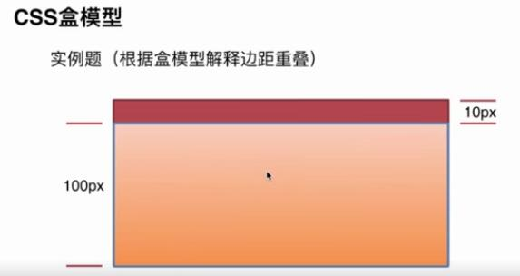
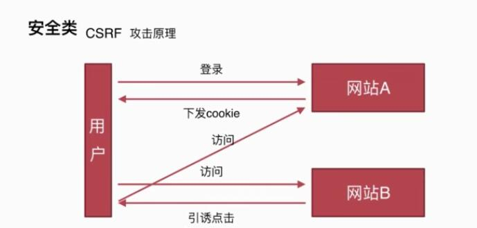
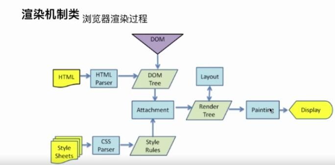
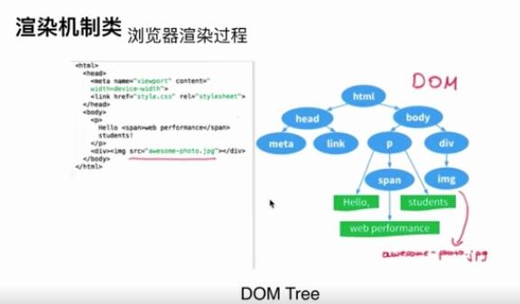
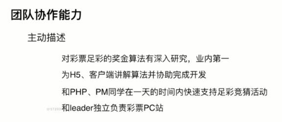
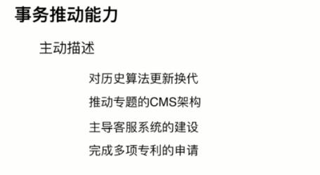

# 面试技巧

# 一二面（基础面）
## 1. 一面基础面

### 1.1 面试准备
#### 1.1.1  个人简历
+ 基本信息：姓名-年龄-手机-邮箱-籍贯
+ 工作经历：时间-公司-岗位-职责-技术栈-业绩（哪些成就）
+ 学历： 博士 > 硕士 > 本科 > 大专
+ 工作经历：时间-公司-岗位-职责-技术栈-业绩
+ 开源项目：GitHub和说明


#### 1.2.2 自我陈述
##### 1.2.2.1 把我面试的沟通方向（别把自己带到坑里面）
答：我平时喜欢研究一些网站，并对一些技术的原理和好玩的点感兴趣，我自己也喜欢思考，也喜欢尝试探索有没有更好的方式和实现。（有所收留，不要全部说出来，稍微留一点悬念留作面试官来提问）
##### 1.2.2.2 豁达、自信的适度发挥
答：适当自信，向自己擅长的方向上面来引路；要让面试官来欣赏我，而不是来鄙视他。

##### 1.2.2.3 自如谈兴趣
（豁达自信，适当收住），巧妙演示实例，适时讨论疑问（不知道的问题请求指导一下，如何去解决，不要说不知道，或者不了解）
##### 1.2.2.4 节奏要适宜
切忌小聪明（尽量把问题的所有实现方法都写出来，表现出来的是熟练）

### 1.2 面试实战
> [!NOTE]
    > 1. 方向要对，过程要细（性能优化，过程详细）
    > 2. 胆子要大、心态要和（算法题认真思考，认真使劲想；敢于承担责任，不要轻易放弃）

## 2. CSS相关
### 2.1  页面布局
#### 2.1.1 如何实现垂直居中布局呢？
> 1.已知宽高


```css
/*v1*/
.container {
    position: absolute;
    left: 50%;
    top: 50%;
    marigin-left: -width / 2;
    marigin-top: -width / 2;
}

/*v2*/
.container {
    position: absolute;
    top: calc(50% - 5em);
    left: calc(50% - 9em);
}

```
> 2.未知宽高


```css
/*v1*/
.container {
    position: absolute;
    top: 50%;
    left: 50%;
    transform: translate(-50%, -50%);
}

/*v2:flex+ auto*/
.wrapper {
    dislay: flex;
}
.content {
    margin: auto;
}

/*v3. 父元素居中*/
.wrapper {
    display: flex;
    /* 盒子横轴的对齐方式 */
    justify-content: center;
    /* 盒子纵轴的对齐方式 */
    align-items: center;
}

/*v4.body内部居中*/
.content {
     /* 1vh = 1% * 视口高度 */
      margin: 50vh auto;
      transform: translateY(-50%);
}
```

#### 2.1.2 如何实现水平居中布局呢？
1. 如果需要居中的元素为常规流中 inline / inline-block 元素，为父元素设置 text-align: center;
2. 父元素上设置 text-align: center; 居中元素上margin 为 auto。
3. 如果元素positon: absolute; 那么 
   - 0）设置父元素postion: relative 
   - 1）为元素设置宽度，
   - 2）偏移量设置为 50%，
   - 3）偏移方向外边距设置为元素宽度一半乘以-1

#### 2.1.3 如何实现三栏布局呢？
1. left和right写在center前面，并且分别左右浮动；
2. 左右区域分别postion：absolute，固定到左右两边;中间的这个div因为是块级元素，所以在水平方向上按照他的包容块自动撑开。
3. 父元素display: table;并且宽度为100%; 每一个子元素display: table-cell; 左右两侧添加宽度，中间不加宽度
4. 包裹这个3个块的父元素display: flex; 中间的元素flex: 1;
5. 网格布局
```css
/* 网格布局 */
.wrapper {
    display: grid;
    width: 100%;
    grid-template-columns: 300px 1fr 300px;
}
```

### 2.2 知道CSS动画的实现吗？
> [!NOTE]
> 知道transition 过渡动画和animation 关键帧动画区别和具体实现。
> - 1.CSS动画实现轮播图
> - 2.CSS动画实现旋转的硬币
> - 3.CSS动画实现钟摆效果


### 2.3 CSS盒子模型
#### 2.3.1 说一下CSS的盒子模型？标准模型和IE模型的区别？CSS如何设置这两种模型？
---
+ 标准盒子模型：width = content
+ IE盒子模型：width = content + pading + border
---
+ box-sizing : content-box
+ box-sizing : border-box


### 2.4 CSS样式获取
#### 2.4.1 JS如何设置获取盒子模型对应的宽度和高度？(面试重点)
---
+ dom.style.width/height ： 只能取到内联样式的的属性信息（拿不到外部引入的CSS样式信息的）
+ dom.currentStyle.width/height : 会拿到浏览器渲染之后的属性信息（IE浏览器）
+ window.getComputedStyle(dom).width/height : Chrome/Firefox 兼容， Firefox可以通过document.defaultView.getComputedStyle(dom)的方式来获取
+ dom.getBoundingClientRect().width/height : 可以获取距离viewport位置的宽度和高度
---

### 2.5 BFC
#### 2.5.1 根据盒子模型解释边距额重叠问题？边距重叠问题的解决方案？

+ 父子元素
+ 兄弟元素
+ 其他    --------------------------计算方式：以参数的最大值来进行计算


**解决方案**：对父级元素创建BFC

#### 2.5.2 BFC原理
> [!NOTE]
> BFC： 块级格式化上下文，IFC（内联格式化上下文）

1. 在BFC的垂直边距上面会发生重叠
2. BFC的区域不会与浮动元素的BOX重叠
3. BFC在页面上是一个独立的渲染区域，外部的元素不会影响到我，同时也不会影响到外部的元素
4. 计算BFC的高度的时候，浮动元素也会参与运算


#### 2.5.3  如何创建BFC？
1. float值不是none
2. position值不是static或者relative
3. display值为table, table-cell, inline-box1. 
4. overflow : auto/hidden


#### 2.5.4 BFC的使用场景？（重点理解）
1. **解决边距的重叠问题**
```html
<section id="margin">
        <style>
            #margin {
                background-color: #4eff35;
                overflow: hidden;
            }
            #margin>p {
                /*上 左右 下*/
                margin: 5px auto 25px;
                background-color: #ff255f;
            }
        </style>
        <p>1</p>
        <!--把一个元素放在一个容器里面，为这个容器创建BFC即可解决边距重叠问题-->
        <div style="overflow: hidden">
            <p>2</p>
        </div>

        <p>3</p>
</section>
```
2. **BFC 不与float部分重叠的解决**
```html
<section id="layout">
      <style>
          #layout {
              background-color: #48adff;
          }
          #layout .left {
              float: left;
              height: 300px;
              width: 200px;
              background-color: #ff4344;
          }
          #layout .right {
              height: 400px;
              background-color: #ff255f;
              /*给右边的这个盒子容器创建一个BFC, 这个容器里面的内容就会沿着垂直方向延伸*/
              overflow: auto;
              /*overflow: auto;*/
              /*display: table;*/
              /*float: left;*/
              /*position: fixed;*/
          }
      </style>
      <div class="left">
          LEFT
      </div>
      <div class="right">
          RIGHT
          <p>111</p>
          <p>111</p>
          <p>111</p>
          <p>111</p>
          <p>111</p>
          <p>111</p>
          <p>111</p>
          <p>111</p>
          <p>111</p>
          <p>111</p>
          <p>111</p>
          <p>111</p>
          <p>111</p>
          <p>111</p>
          <p>111</p>
      </div>
  </section>
```
3. **BFC子元素即使是float元素也要参与运算**
```html
<section id="float">
      <style>
          /*一个盒子内部的内容如果是浮动的话，那么这个盒子的内容实际上是不参与父容器高度计算的*/
          #float {
              background-color: red;
              /*overflow: hidden;*/
              float: left;
          }
          #float .float {
              float: left;
              font-size: 30px;
          }
      </style>
      <div class="float">
          我是浮动的元素
      </div>
</section>
```

## 3. 事件相关
### 3.1 DOM事件
#### 3.1.1 DOM事件的级别有哪些？
> [!NOTE]
> DOM级别一共可以分为四个级别：DOM0级、DOM1级、DOM2级和DOM3级。而DOM事件分为3个级别：DOM0级事件处理，DOM2级事件处理和DOM3级事件处理。

1. DOM0 : element.onclick = function(e) {}
     DOM1 ：该标准中未涉及到事件绑定的相关东西
2. DOM2 : element.addEventListener('click', function(e){}, false)， 一个DOM元素可以添加多个事件
3. DOM3 : element.addEventListener('keyup', function(e){}, false)，在DOM2标准基础上面增加了新的事件类型：鼠标事件，键盘事件，焦点事件  

#### 3.1.2 DOM事件模型有哪些？
1. 事件捕获：从外向内, window -> document -> body -> button
2. 事件冒泡：从内向外，button -> body -> document -> window

#### 3.1.3 DOM事件流？
浏览器为当前的页面与用户进行交互的过程中，点击鼠标后事件如何传入和响应的呢？
+ 1. 捕获阶段：从外部容器开始向内
+ 2. 目标阶段：事件通过捕获到达目标阶段
+ 3. 冒泡阶段：从目标元素再上传到window对象


#### 3.1.4 什么事件可以代理？什么事件不可以代理呢？
什么样的事件可以用事件委托，什么样的事件不可以用呢？ 

> [!NOTE]
> 1. 通常支持事件冒泡（Event Bubbling）的事件类型为鼠标事件和键盘事件，例如：mouseover, mouseout, click, keydown, keypress。
> 2. 接口事件(**指的是那些不一定与用户操作有关的事件**)则通常不支持事件冒泡（Event Bubbling），例如：load, change, submit, focus, blur。


**很明显**：focus 和 blur 都属于不支持冒泡的接口事件。既然都不支持冒泡，那又如何实现事件代理呢？

#### 3.1.5 IE和DOM事件流的区别？
IE采用冒泡型事件 Netscape使用捕获型事件 DOM使用先捕获后冒泡型事件
1. 冒泡型事件模型： button -> div -> body (IE浏览器本身只支持Bubbling不支持Capturing)
2. 捕获型事件模型： body -> div-> button (Netscape事件流，网景浏览器公司)
3. DOM事件模型： body -> div -> button -> button -> div -> body (先捕获后冒泡，除了IE以外的其他浏览器都支持标准的DOM事件处理模型)

> [!NOTE]
+ 规范和浏览器实现的差别？
  - DOM2级事件规范的捕获阶段，事件从文档节点document开始传播，现代浏览器大多数都是从window对象开始传播事件的；
  - DOM2级事件规范捕获阶段不涉及事件目标，现代浏览器大多数都在这个阶段包含事件目标。
  
#### 3.1.6 事件对象event的属性方法的差别?
```
        IE                    DOM
cancelBubble = true    stopPropagation()    // 停止冒泡
returnValue = false    preventDefault()     // 阻止元素默认事件
srcEelement            target               // 事件目标
```

#### 3.1.7 描述DOM事件捕获的具体流程？
**window -> document -> HTML标签 -> body -> ... -> 目标元素**

> [!NOTE]
> 关键点： 注意根节点是window这个对象的

```html
<!DOCTYPE html>
<html lang="en">
<head>
  <meta charset="UTF-8">
  <title>Title</title>
</head>
<body>
  <div id="container">
      <style>
          #container {
              width: 200px;
              height: 200px;
              background-color: #ff255f;
          }
      </style>
  </div>
  <script>
      // 事件捕获机制
      window.addEventListener('click', function(){
          console.log('window capture');
      }, true)
      document.addEventListener('click', function () {
          console.log('document capture');
      }, true)
      document.documentElement.addEventListener('click', function () {
          console.log('HTML capture');
      }, true)
      document.body.addEventListener('click', function () {
          console.log('body capture');
      }, true)
      document.getElementById('container').addEventListener('click', function () {
          console.log('container capture');
      }, true)

      // 事件冒泡机制
      window.addEventListener('click', function(){
          console.log('window capture');
      })
      document.addEventListener('click', function () {
          console.log('document capture');
      })
      document.documentElement.addEventListener('click', function () {
          console.log('HTML capture');
      })
      document.body.addEventListener('click', function () {
          console.log('body capture');
      })
      document.getElementById('container').addEventListener('click', function () {
          console.log('container capture');
      })

      // 输出结果
      window capture  --> document capture --> HTML capture --> body capture --> container capture --> container capture -->  body capture --> HTML capture --> document capture --> window capture
  </script>
</body>
</html>
```

#### 3.1.8 如何拿到HTML这个标签节点元素呢？(加分项)
```js
  var html = document.documentElement;
```

#### 3.1.9 描述Event对象的常见应用？
1. e.preventDefault() : 阻止默认事件（如阻止a标签的默认跳转行为）
2. e.stopPropagation() : 阻止事件冒泡的行为
3. *** e.stopImmediatePropagation() : 事件响应的优先级的应用场景，如果一个元素绑定了多个事件，但是又不想让其他的事件执行的时候使用该方法【也会阻止冒泡】
4. e.currentTarget : 当前所绑定的事件对象

```js
  document.documentElement.onclick = function(e) {
    console.log(e.currentTarget, e.target);       // <html><body>...</body></html>（）给绑定事件的那个元素, 当前被点击的那个元素
  }
```
> [!NOTE]
> e.target : 当前被点击的元素，父元素使用事件代理的方式来实现，可以直接使用该属性获取被点击的那个元素

### 3.2 如何自定义事件？(重点))
#### 3.2.1 如何给一个按钮绑定一个自己定义的事件呢？
```js
  // v1. 使用Event对象来自定义事件
  // 开始创建一个自己定义的事件对象
  var eve = new Event('customEvent');
  // 使用dom2事件处理的方式来给这个元素绑定一个事件
  var dom = document.documentElement;
  dom.addEventListener('customEvent', function(e) {
    console.log('customEvent called!');
  });
  // 下面的这句话可以在适合的场景中来触发一个自己定义的事件对象
  setTimeout(function(){
    // 在1s之后触发这个事件
    dom.dispatchEvent(eve);
  }, 1000)


  // v2. 使用CustomEvent来实现自定义事件
  var dom = document.documentElement;
  // 使用CustomEvent的方式可以在事件触发的时候传递一个参数，然后通过e.detail 的方式来获取这个参数信息
  var myClick = new CustomEvent('myClick', {detail : {name : 'zhangsan', age : 24}});
  dom.addEventListener('myClick', function(e){
    console.log(e.detail, e.target)
  })
  dom.dispatchEvent(myClick);

```

## 4. HTTP协议
### 4.1 HTTP协议的主要特点？
+ 简单快速
+ 灵活
+ 无连接
+ 无状态
  
### 4.2 HTTP报文的组成部分？
+ 请求报文
  请求行：请求方法 资源地址 HTTP版本
  请求头： key : value
  空行 :
  请求体 : name=zhangsan&age=18
+ 响应报文 : HTTP版本 状态码
  状态行
  响应头
  空行
  响应体  

### 4.3 HTTP方法？
+ GET : 获取资源
+ POST ： 传输资源
+ PUT ：更新资源
+ DELETE ： 删除资源
+ HEAD ：获取报文首部
+ OPTIONS : 允许客户端查看服务器的性能。
  
### 4.4 POST和GET的区别？
1. **GET请求在浏览器回退的时候是无害的，而POST会再次提交请求**
2. GET请求产生的URL地址可以被收藏，而POST不可以
3. **GET请求会被浏览器主动缓存，而POST不会，除非主动设置**
4. GET请求只能进行URL编码，而POST支持多种编码方式
5. GET请求参数会被完整第保留在浏览器的历史记录里面，而POST参数不会被保留
6. **GET请求爱URL中传送的参数的长度是有限的（2KB），而POST没有限制**
7. 对参数的数据类型，GET值接受ASCII字符，而POST没有限制
8. POST比GET更安全，GET参数直接暴露在URL上，所以不能用来传递敏感信息
**9. GET参数通过URL传递，POST参数直接放在了Request body中**

### 4.5 HTTP状态码？
#### 4.5.1 状态码的第一位
+ **1xx** ：指示信息-表示请求已接收，继续处理（重点）
+ 2xx ：成功-表示请求已被成功接收
+ 3xx ：重定向-要完成请求必须进行更进一步的操作
+ 4xx ：客户端错误-请求有语法错误或请求无法实现
+ 5xx ：服务器错误-服务器未能实现合法的请求

#### 4.5.2 状态码详解
+ 200 OK ： 客户端请求成功
+ 206 Partial Content ： 客户端发送了一个带有Range头的GET请求（Video标签或者audio标签在请求数据的时候）
+ 301 Moved Permanently ： 请求的页面已经转移到了新的URL
+ 302 Found ： 所请求的页面已经临时转移到了新的URL
+ 304 Not Modified ：客户端有缓冲的文档并发出了一个条件下的请求，原来缓冲的文档还可以继续使用
+ 400 Bad Request ： 客户端请求有语法错误，不被服务器所理解
+ 401 Unauthorized ： 请求未经授权，这个状态码必须和WWW-Authenticate报头域一起使用
+ 403 Forbidden：对被请求页面的访问被禁止
+ 404 Not Found ： 请求资源不存在
+ 500 Internal Server Error ：服务器发生不可预期的错误，原来缓冲的文档还可以继续使用
+ 503 Service Unavailable ： 请求未完成，服务器临时过载或宕机，一段时间后可能恢复正常

### 4.6 什么是持久连接？
> [!NOTE]
> HTTP协议采用‘请求-应答’模式， HTTP1.1版本才支持的，使用Keep-alive字段可以建立一个长连接，从而不需要每次请求都去建立一个新的连接。

### 4.7 什么是管线化？
#### 4.7.1 基本概念
+ 在使用持久连接（Keep-alive）的情况下，某个连接上的消息的传递类似于：请求1 --> 响应1 --> 请求2 --> 响应2 --> 请求3 --> 响应3
+ 管线化的过程： 请求1 --> 请求2 --> 请求3 --> 响应1 --> 响应2 --> 响应3
  
#### 4.7.2 管线化的特点（特点）

1. **管线化机制通过持久连接完成，仅在HTTP1.1版本之后支持**
2. **只有GET和HEAD请求可以进行管线化，POST有所限制的**
3. **初次创建连接的时候不应该启动管线机制，因为对方（服务器）不一定支持HTTP1.1版本的协议**
4. 管线化不会影响到响应到来的顺序，HTTP响应返回的顺序并未改变
5. HTTP1.1 要求服务器支持管线化，但并不要求服务器也对响应进行管线化处理，只是要求对于管线化的请求不失败即可
6. 由于上面提到的服务器端问题，开启管线化很可能并不会带来大幅度的性能提升，而且很多服务器和代理程序对管线化的支持并不好，因此现代的浏览器如Chrome和Firefox默认并没有开启管线化支持

## 5. 原型链
### 5.1 创建对象的几种方法？
```js
// 1. 使用字面量的方式来创建
var o1 = {name : 'zhangsan'};
var o11 = new Object({name : 'zhangsan'});

// 2. 使用普通构造函数的方式来创建
var M = function(){
    this.name = 'zhangsan';
}
var o2 = new M();

// 3. Object.create方法
var p = {name : 'zhangsan'};
var o3 = Object.create(p);
```
### 5.2 原型、构造函数、实例、原型链？
**构造函数**：使用new运算符来声明一个实例（任何函数都是可以通过构造函数来使用的）

**原型链**：通过原型链可以找到上一级别的原型对象

**原型对象**：多个实例公用的数据和属性或者方法


### 5.3 instanceof的原理？
> [!NOTE]
> instanceof 检测一个对象A是不是另一个对象B的实例的原理是：查看对象B的prototype指向的对象是否在对象A的[[prototype]]链上。如果在，则返回true,如果不在则返回false。不过有一个特殊的情况，当对象B的prototype为null将会报错(类似于空指针异常)。

```js
// 2. 使用普通构造函数的方式来创建
var M = function(){
  this.name = 'zhangsan';
}
var o2 = new M();
undefined
o2.__proto__ == M.prototype
true
o2.__proto__ == M.prototype
true
o2.__proto__.constructor === Object
false
o2.__proto__.constructor === M
true
```

### 5.4 new运算符的原理？
1. 一个新对象被创建。它继承于foo.prototype
2. 构造函数foo被执行。执行的时候，相应的传参会被传入，同时上下文(this)会被指定为这个新实例，new foo等同于 new foo(),只能用在不传递任何参数的情况
3. 如果构造函数返回了一个“对象”，那么这个对象会取代整个new出来的结果。如果构造函数没有返回对象，那么new 出来的结果为步骤1创建的对象
   
```js
// new 一个对象的过程
var _new = function (fn) {
  // 1. 创建一个对象，这个对象要继承fn这个构造函数的原型对象
  var o = Object.create(fn.prototype);
  // 2. 执行构造函数
  var k = fn.call(o, arguments);
  // 3. 看下执行的这个函数的运行效果是不是函数
  if (typeof k === 'object'){
      return k;
  }
  else
  {
      return o;
  }
}
```
## 6. 面向对象
### 6.1 类与继承：如何实现继承，继承的几种实现方式
```html
<!DOCTYPE html>
<html lang="en">
<head>
  <meta charset="UTF-8">
  <title>Title</title>
</head>
<body>
<script>
  // 类的声明
  function Animal1() {
      this.name = 'name';
  }
  // ES6 中的class的声明
  class Animal2 {
      constructor(){
          this.name = 'name';
      }
  }

  console.log(new Animal1(), new Animal2());
  ///////////////////////////////////////////////////////////////////////////////////////////


  // 如何实现类的继承呢？？？-----------本质：原型链
  // v1. 借助构造函数实现继承
  function Parent1() {
      this.name = 'parent1'
  }
  Parent1.prototype.sayHello = function () {
      console.log('hello');
  }
  function Child1() {
      // 执行父亲的构造函数：
      // 1. 实现原理：将父级函数的this指向了这个子类的实例上面去了
      // 2. 缺点：父亲的原型链上面的方法或者属性不能被继承；只能实现部分继承
      Parent1.call(this);
      this.type = 'child1';
  }
  // 没有参数的时候，可以直接new + 函数名称
  console.log(res = new Child1);


  // v2. 借助原型链实现继承
  function Parent2() {
      this.name = 'parent2';
      this.data = [1, 2, 3];
  }
  Parent2.prototype.sayHello = function () {
      console.log('hello');
  }
  function Child2() {
      this.type = 'child2';
  }
  // prototype 就是为了让这个对象的实例可以访问到原型链上的内容
  Child2.prototype = new Parent2();
  // new Child2().__proto__ === Child2.prototype  // true
  // new Child2().__proto__.name                  // parent2
  // 原型链继承的缺点：
  // 1. 原理：通过修改原型链来实现对象的继承关系
  // 2. 缺点：修改第一个对象上面的属性，会直接修改第二个对象属性数据(引用类型)
  var c1 = new Child2();
  var c2 = new Child2();
  c1.data.push(100, 200, 300);

  // v3. 组合继承
  function Parent3() {
      this.name = 'parent3';
      this.data = [1, 2, 3];
  }
  function Child3() {
      // 1. 借用构造函数继承
      Parent3.call(this);
      this.type = 'child3';
  }
  // 2. 原型链继承
  // child3的原型对象是Parent3的一个实例对象，但是这个实例对象中是没有constructor这个属性的，因此寻找属性的时候回沿着这个实例对象的原型链继续向上寻找new Parent3().prototype 这个原型对象的，
  // 最终在Parent3.prototype这个原型对象中找到了这个属性，new一个对象找的实际上是{Parent3.prototype.constructor : Parent3}
  Child3.prototype = new Parent3();
  var c1 = new Child3();
  var c2 = new Child3();
  c1.data.push(100, 200, 300);
  // 组合继承的特点：
  // 1. 原理：结合借用构造函数继承和原型链继承的优点，摒弃二者的缺点
  // 2. 缺点：父类构造函数在创建实例的时候总共执行了两次（new Parent3(), new Child3()）


  // v4. 组合继承的优化1
  function Parent4() {
      this.name = 'parent4';
      this.data = [1, 2, 3];
  }
  function Child4() {
      // 1. 借用构造函数继承
      Parent4.call(this);
      this.type = 'child4';
  }
  // 让子类的构造函数的原型对象和父类构造函数的原型对象执向同一个对象(都是同一个对象)
  Child4.prototype = Parent4.prototype;
  // 测试
  var c1 = new Child4();
  var c2 = new Child4();
  console.log(c1 instanceof Child4, c1 instanceof Parent4);
  console.log(c1.constructor)         // Parent4? 如何实现：c1.constructor(c1.__proto__.constructor) === Child4 呢？
  // 缺点：
  // 1. 无法通过原型对象的constructor属性来获取对象的属性对应的构造函数了(子类和父类公用的是一个contructor)
  // 2. obj instanceof Child4 === true; obj instanceof Parent4 === true
  // 3. obj.__proto__.constructor === Child4; obj.__proto__.constructor === Parent4  ???

  // v5. 组合继承的优化2【完美写法】
  function Parent5() {
      this.name = 'parent5';
      this.data = [1, 2, 3, 4, 5];
  }
  function Child5(){
      Parent5.call(this);
      this.type = 'child5';
  }

  // 通过创建中间对象的方式来把两个对象区分开
  // var obj = new Object(); obj.__proto__ = Constructor.prototype;
  // 1. Object.create创建的对象obj, 这个obj的原型对象就是参数
  // 2. Child5的原型对象是Child5.prototype
  // 3. Child5.prototype = obj，obj这个对象相当于就是一个中间的桥梁关系
  Child5.prototype = Object.create(Parent5.prototype);
  // 当前的方式还是会按照原型链一级一级向上寻找的, 给Child5的原型对象上面绑定一个自己定义的constructor属性
  Child5.prototype.constructor = Child5;

  // var s1 = new Child5()

  // 上面的代码等价于
  var obj = Object.create(Parent5.prototype);     // obj.prototype = Parent5.prototype
  Child5.prototype = obj;
  Child5.prototype.constructor = Child5;
  // 1. 对象之间就是通过__proto__ 属性向上寻找的
  // 2. 寻找规则： child5 ---> Child5.prototype ---> obj(Object.create(Parent5.prototype)) ---> Parent5.prototype


  // 技巧：不要让面试官问太多题目：拖拉时间【挤牙膏】，把一个问题尽量吃透
  // 消化这一块内容
</script>
</body>
</html>
```

> [!WARNING]
> 面试技巧
1. 不要让面试官问太多题目：拖拉时间【挤牙膏】，把一个问题尽量吃透
2. 知识深度


## 7. 通信
### 7.1 什么是同源策略个限制？
> [!NOTE]
> 同源策略限制是从一个源加载的文档或脚本如何与来自另一个源的资源进行交互。这是一个用于隔离潜在恶意文件的关键的安全机制。（一个源的文档或脚本是没有权利直接操作另外一个源的文档或脚本的）

1. **Cookie， LocalStorage和IndexDB无法读取**
2. DOM无法获得；（document.body是无法获取的）
3. Ajax请求不能发送


### 7.2 前后端如何进行通信呢？
1. Ajax（有同源策略限制）；Fetch API则是XMLHttpRequest的最新替代技术， 它是W3C的正式标准
2. WebSocket：支持跨域请求数据，没有同源策略的限制
3. CORS：新的协议通信标准；CORS则将导致跨域访问的请求分为三种：Simple Request，Preflighted Request以及Requests with Credential；cors相对于jsonp而言的好处就是支持所有的请求方式，不止是get请求，还支持post,put请求等等，而它的缺点就很明显，无法兼容所有的浏览器，对于要兼容到老式浏览器而言，还是使用jsonp好点


### 7.3 如何创建Ajax呢？
1. XMLHttpRequest对象的工作流程
2. 浏览器的兼容性处理【重点】
3. 事件的触发条件
4. 事件的触发顺序


```js
  function ajax(params){
    // 1. 创建对象，考虑兼容性【重点】
    var xhr = XMLHTTPRequest ? new XMLHTTPRequest() : new window.ActiveXObject('Microsoft.XMLHTTP');      // *** 兼容性问题必须考虑
    // 2. 打开连接
    var type = params.type || 'GET',
        url = params.url || '',
        data = params.data || {},
        success = params.success,
        error = params.error,
        dataArr = [];
    for (var k in data) {
      dataArr.push(k + '=' + data[k]);
    }
    //带上Cookie
    xhr.withCredentials = true;
    if (type.toUpperCase() === 'GET') {
      // get
      url += '?' + dataArr.join('&');
      // 问号结尾的话，直接替换为空字符串
      xhr.open(type, url.replace(/\?$/g, ''), true);
      // GET 请求的话，是不需要再send方法中带上参数的
      xhr.send();
    }
    else {
      // POST
      xhr.open(type, url, true);
      xhr.setRequestHeader('Content-type', 'application/x-www-form-urlencoded');
      // POST 请求需要把数据放在send方法里面， data = name=zhangsna&age=18&sex=male
      xhr.send(dataArr.join('&'));
    }
    // 开始监听变化
    xhr.onreadystatechange = function(){
      // 这里需要考虑强缓存和协商缓存的话直接处理，206是媒体资源的创建方式
      if (xhr.readyState === 4 && xhr.status === 200 || xhr.status === 304) {
          var res;
          if (success instanceof Function) {
            res = xhr.responseText;
            if (typeof res === 'string') {
              res = JSON.parse(res);
              // 开始执行成功的回调函数
              success.call(xhr, res);
            }
          } else {
            if (error instanceof Function) {
              // 失败的话直接返回这个responseText中的内容信息
              error.call(xhr, res);
            }
          }
      }
    }
  }
```
### 7.4 跨域通信的几种方式？
#### 7.4.1 JSONP
```js
  function jsonp(url, onsuccess, onerror, charset){
    // 1. 全局注册一个callback
    var callbackName = 'callback' + Math.random() * 100;
    window[callbackName] = function(){
      if (onsuccess && typeof onsuccess === 'Function') {
        onsuccess(arguments[0]);
      }
    }
    // 2. 动态创建一个script标签
    var script = document.createElement('script');
    script.setAttribute('type', 'text/javascript');
    charset && script.setAttribute('charset', charset);
    script.setAttribute('src', url);
    script.async = true;
    // 3. 开始监听处理的过程
    script.onload = script.onreadystatechange = function(){
      if (!script.readyState || /loaded|complete/.test(script.readyState)) {
        // 4. 成功之后移除这个事件
        script.onload = script.onreadystatechange = null;
        // 删除这个script的DOM对象（head.removeChild(script), 这个DOM节点的父节点相当于是head标签这个父节点）
        script.parentNode && script.parentNode.removeChild(script);
        // 删除函数或变量
        window[callbackName] = null;
      }
    }
    script.onerror = function(){
      if (onerror && typeof onerror === 'Function') {
        onerror();
      }
    }
    // 5. 开始发送这个请求(把这个标签放在页面中的head标签中即可)
    document.getElementsByTagName('head')[0].appendChild(script);
  }
```
#### 7.4.2 Hash 
hash 改变后页面不会刷新的

> [!NOTE]
> 使用场景：当前的页面A通过iframe或者frame嵌入了跨域的页面

```js
  // 1. A页面中的代码如下
  var B = document.getElementsByTagName('iframe');
  B.src = B.src + '#' + JSON.stringfy(data);
  // 2. B中的伪代码如下
  window.onhashchange = function(){
    var data = window.location.hash;    // 接受数据
    data = JSON.parse(data);
  }
```

#### 7.4.3  postMessage(HTML5中新增)
> [!NOTE]
> 使用场景： 可以实现窗口A(A.com)向窗口B(B.com)发送信息

```js
  // 1. 窗口B中的代码如下
  var BWindow = window;
  BWindow.postMessage(JSON.stringfy(data), 'http://www.A.com');   
  // 2. 窗口A中代码
  var AWindow = window;
  AWindow.addEventListener('message', function(e){
      console.log(e.origin);                  // http://www.B.com
      console.log(e.source);                  // BWindow

      e.source.postMessage('已成功收到消息');

      console.log(JSON.parse(e.data));        // data
  }, false)
  // 父窗口给子窗口发信息，需要用iframe的contentWindow属性作为调用主体
  // 子窗口给父窗口发的信息需要使用window.top，多层iframe使用window.frameElement
```

#### 7.4.4 . WebSocket
> [!NOTE]
> 不受同源策略影响，可以直接使用

```js
  var ws = new window.WebSocket('ws://echo.websocket.org');

  // 打开连接
  ws.onopen = function(e){
    console.log('Connection open ……');
    ws.send('Hello WebSocket!');
  }

  // 接受消息
  ws.onmessage = function(e){
    console.log('Received Message : ', e.data);
  }

  // 关闭连接
  ws.onclose = function(e){
    console.log('Connection closed');
  }
```
#### 7.4.5 CORS 
> 支持跨域通信版本的Ajax，是一种新的标准（Origin头）【ajax的一个变种，适用于任何】

http://www.ruanyifeng.com/blog/2016/04/cors.html
```js
  fetch('/get/name', {
    method : 'get'
  }).then(function(response){
    console.log(response);
  }).catch(function(err){
    // 出错了；等价于then的第二个参数
  });
  // 原因：浏览器默认会拦截ajax请求，会根据头中的origin消息进行判断处理消息；Origin字段用来说明，本次请求来自哪个源（协议 + 域名 + 端口）。服务器根据这个值，决定是否同意这次请求。JSONP只支持GET请求，CORS支持所有类型的HTTP请求。JSONP的优势在于支持老式浏览器，以及可以向不支持CORS的网站请求数据。
```
##### 7.4.5.1 CORS请求的基本流程
1. 对于简单请求，浏览器直接发出CORS请求。具体来说，就是在头信息之中，增加一个Origin字段。
2. Origin字段用来说明，本次请求来自哪个源（协议 + 域名 + 端口）。服务器根据这个值，决定是否同意这次请求。
3. 如果Origin指定的源，不在许可范围内，服务器会返回一个正常的HTTP回应。浏览器发现，这个回应的头信息没有包含Access-Control-Allow-Origin字段（详见下文），就知道出错了，从而抛出一个错误，被XMLHttpRequest的onerror回调函数捕获。
4. 如果Origin指定的域名在许可范围内，服务器返回的响应，会多出几个头信息字段。
   
```
  Access-Control-Allow-Origin: http://api.bob.com   // 必需的字段
  Access-Control-Allow-Credentials: true            // 可选字段： 是否允许发送cookie
  Access-Control-Expose-Headers: FooBar
  Content-Type: text/html; charset=utf-8
```

5. 简单请求的CORS请求，会在正式通信之前，增加一次HTTP查询请求，称为"预检"请求（preflight）。OPTIONS表示当前的这个请求是用来询问的；服务器收到"预检"请求以后，检查了Origin、Access-Control-Request-Method和Access-Control-Request-Headers字段以后，确认允许跨源请求，就可以做出回应。

##### 7.4.5.2 JSONP和CORS的区别？
1. JSONP只支持GET请求，CORS支持所有类型的HTTP请求
2. JSONP的优势在于支持老式浏览器，以及可以向不支持CORS的网站请求数据。


## 8. 安全
### 8.1 CSRF
#### 8.1.1 基本概念和缩写
CSRF： 跨站请求伪造，Cross site request forgery

#### 8.1.2 CSRF 攻击原理


#### 8.1.3 可以成功攻击的条件？
1. 目标网站存在CSRF漏洞的请求接口（一般为get请求）
2. 目标用户之前已经成功登录过这个网站（留下了Cookie）

#### 8.1.4 如何防御呢？
1. **Token验证**：访问服务器接口的时候，会自动带上这个token
2. **Referer验证**：验证网站的页面来源（只有我当前网站下的页面才可以请求，对于来自其他网站的请求一律拦截）
3. **隐藏令牌**： 隐藏信息会放在header中（类似于Token）
   
### 8.2 XSS
#### 8.2.1 基本概念和缩写
XSS： cross-site scripting, 跨站脚本攻击
#### 8.2.2 XSS防御

**攻击原理**: 注入JS脚本

**防御措施**: 让JS代码无法解析执行

### 8.3 CSRF和XSS的区别呢？
1. CSRF：网站本身存在漏洞的接口，依赖这些登录过目标网站的用户来实现信息的窃取；
2. XSS：向页面中注入JS执行，JS函数体内执行目标任务；


> [!NOTE]
1. 一定要说出中文名称，实现原理，防范措施都说出来
2. 不要拖泥带水，言简意赅


## 9. 算法
> [!NOTE]
> 算法攻略：多刷题才是硬道理！！！


# 二三面（知识深度面）
## 10. 渲染机制
### 10.1 什么是DOCTYPE及作用？
1. DTD（Document Type Definition）：文档类型定义，是一系列的语法规则，用来定义XML或者(X)HTML的文件类型。浏览器会使用它来判断文档的类型，决定使用哪一种协议来解析，以及切换浏览器模式；
2. DOCTYPE： 是用来声明文档类型和DTD规范的，一个主要的用途是文件的合法性验证；如果文件代码不合法，那么浏览器解析的时候就会出现一些出错
3. 总结：Doctype就是通知浏览器当前的文档是属于那种类型的，包含哪些DTD。
   
```html
  <!--HTML5的写法-->
  <DOCTYPE html>
  <!-- HTML 4.01  Strict
    1. 这个DTD 包含所有的HTML元素和属性
    2. 但是不包含展示性的和弃用的元素（比如font）
  -->
  <DOCTYPE HTML PUBLIC "-//W3C//DTD HTML 4.01//EN" "http://www.w3.org/TR/html4/strict.dtd" >
  <!-- HTML 4.0.1 Transitional
    1. 这个DTD 包含所有的HTML元素和属性
    2. 也包含展示性的和弃用性的元素（比如font）
  -->
  <DOCTYPE HTML PUBLIC "-//W3C//DTD HTML 4.01 Transitional//EN" " http://www.w3.org/TR/html4/loose.dtd" >
```
---

> [!NOTE]
> 在W3C标准出来之前，不同的浏览器对页面渲染有不同的标准，产生了一定的差异。这种渲染方式叫做混杂模式。在W3C标准出来之后，浏览器对页面的渲染有了统一的标准，这种渲染方式叫做标准模式。<!DOCTYPE>不存在或者形式不正确会导致HTML或XHTML文档以混杂模式呈现，就是把如何渲染html页面的权利交给了浏览器，有多少种浏览器就有多少种展示方式。因此要提高浏览器兼容性就必须重视<!DOCTYPE>
  
### 10.2 严格模式和混杂模式
> [!NOTE]
> 严格模式和混杂模式都是浏览器的呈现模式，浏览器究竟使用混杂模式还是严格模式呈现页面与网页中的DTD（文件类型定义）有关，DTD里面包含了文档的规则。比如：loose.dtd

- **严格模式**：又称标准模式，是指浏览器按照W3C标准来解析代码，呈现页面
- **混杂模式**：又称为怪异模式或者兼容模式，是指浏览器按照自己的方式来解析代码，使用一种比较宽松的向后兼容的方式来显示页面。

---
### 10.3 浏览器的渲染过程？

#### 10.3.1 开始进行DOM解析，渲染DOM Tree

#### 10.3.2 开始进行CSS解析，渲染CSSOM Tree

#### 10.3.3 DOM树和CSS树的结合，最后会转换为Render Tree

#### 10.3.4 Layout的过程，计算每一个DOM元素的位置、宽度、高度等信息，最终渲染并显示页面到浏览器


### 10.4 何时会触发Reflow？
> [!NOTE]
> 定义：DOM结构中每个元素都有自己的盒子模型，这些都是需要根据各种样式来计算并根据计算结果将元素放在它该出现的位置，这个过程就是reflow；

1. 当你增加、删除、修改DOM节点的时候，会导致Reflow或Repaint
2. 当你移动DOM的位置，或者设置动画的时候
3. 当你修改CSS样式的时候
4. 当你Resize窗口的时候（移动端没有这个问题，与浏览器有关），或者在滚动窗口的时候
5. 当你修改网页的默认的字体的时候


### 10.5 何时回触发Repaint？
> [!NOTE]
> 定义：当各种盒子的位置、大小以及其他属性，例如颜色、字体大小都确定下来以后，浏览器于是便按照元素各自的特性绘制了一遍，于是页面的内容出现了，这个过程就是repaint

1. DOM改动
2. CSS改动

### 10.6 如何最大程度上的减少浏览器的重绘Repaint过程(频率)呢？
#### 10.6.1 避免在document上直接进行频繁的DOM操作，如果确实需要可以采用off-document的方式进行
+ 1. 先将元素从document中删除，完成修改之后然后再把元素放回原来的位置
+ 2. 将元素的display设置为none, 然后完成修改之后再把元素的display属性修改为原来的值
+ 3. 如果需要创建多个DOM节点，可以使用DocumentFragment创建完毕之后一次性地加入document中去
```js
  var frag = document.createDocumentFragment();
  frag.appendChild(dom);    /*每次创建的节点先放入DocumentFragment中*/
```
#### 10.6.2 集中修改样式
1. 尽可能少的修改元素style上的属性
2. 尽量通过修改className来修改样式(一次性修改)
3. 通过cssText属性来设置样式值
```js
  document.getElementById("d1").style.cssText = "color:red; font-size:13px;";
```
#### 10.6.3 缓存Layout的属性值
> [!NOTE]
> 对于Layout属性中非引用类型的值（数字型），如果需要多次访问则可以在一次访问时先存储到局部变量中，之后都使用局部变量，这样可以避免每次读取属性时造成浏览器的渲染。

```js
  var width = el.offsetWidth;
  var scrollLeft = el.scrollLeft;
```
#### 10.6.4 设置元素的position为absolute或fixed
> [!NOTE]
> 在元素的position为static和relative时，元素处于DOM树结构当中，当对元素的某个操作需要重新渲染时，浏览器会渲染整个页面。将元素的position设置为absolute和fixed可以使元素从DOM树结构中脱离出来独立的存在，而浏览器在需要渲染时只需要渲染该元素以及位于该元素下方的元素，从而在某种程度上缩短浏览器渲染时间。

## 11. 布局Layout？
**Layout属性包括**：
1. offsetLeft、offsetTop、offsetHeight、offsetWidth: 相对于父对象的边距信息，且返回值为数字；left获取或设置相对于具有定位属性(position定义为relative)的父对象的边距信息，返回值为字符串10px
2. scrollTop/Left/Width/Height：滚动条在各个方向上拉动的距离，返回值为数字
3. clientTop/Left/Width/Height：浏览器的可视区域的大小
4. getComputedStyle()、currentStyle(in IE)：浏览器渲染DOM元素之后的宽度和高度等样式信息


## 12. JS运行机制
### 12.1 如何理解JS的单线程？
看代码，写结果？
```js
  // 同步任务
  console.log(1);
  // 异步任务要挂起
  setTimeout(function(){
    console.log(2)
  }, 0);
  console.log(3)
  // out : 1 3 2
```
```js
  console.log('A');
  setTimeout(function(){
    console.log('B')
  }, 0);
  while (true) {

  }

  // out : A
```
### 12.2 什么是任务队列？
```js
  for (var i = 0; i < 4; i++) {
    // setTimeout , setInterval 只有在时间到了的时候，才会把这个事件放在异步队列中去
    setTimeout(function(){
      console.log(i);
    }, 1000);
  }
  // out : 4 4 4 4
```
### 12.3 什么是Event Loop？
> [!NOTE]
> JS是单线程的，浏览器引擎会先来执行同步任务，遇到异步任务之后，会把当前的这个异步任务放在time模块中，等到主线程中的所有的同步任务全部执行完毕之后；然后当前的这个异步任务只有时间到了之后，才会把这个任务（回调函数）放在一个异步队列中；当当前的任务栈中的任务全部执行完毕了之后，会先去执行微任务队列中的任务（Promise），然后等到微任务队列中的所有任务全部执行完毕之后，再去执行process.nextTick()这个函数，等到这个函数执行完毕之后，本次的事件轮训结束；
开启新的执行栈，从宏任务队列中依次取出异步任务，开始执行；每个宏任务执行都会重新开启一个新的任务执行栈

#### 12.3.1 3个关键点
1. 执行栈执行的是同步任务；
2. 什么时候去异步队列中取这个任务；
3. 什么时候向这个任务队列中放入新的异步任务
#### 12.3.2 异步任务的分类
- setTimeout, setInterval; 
- DOM事件（点击按钮的时候也会先去执行同步任务）； 
- Promise


## 13. 知识点总结
1. 理解JS的单线程的概念
2. 理解任务队列
3. 理解Event Loop
4. 理解哪些语句会翻入到异步任务队列
5. 理解与放入到异步任务队列的时机
### 13.1 页面性能
#### 13.1.1 提升页面性能的方法有哪些？
1. 资源压缩合并，减少HTTP请求；
2. 非核心代码的异步加载 ---> 异步加载的方式有哪些？ ---> 异步加载的区别？
3. **利用浏览器的缓存 ---> 缓存的分类 ---> 缓存的原理**
4. 使用CDN加速
5. **预解析DNS：DNS Prefetch 是一种DNS 预解析技术，当你浏览网页时，浏览器会在加载网页时对网页中的域名进行解析缓存，这样在你单击当前网页中的连接时就无需进行DNS的解析，减少用户等待时间，提高用户体验。（提前解析域名，而不是点击链接的时候才去进行DNS域名解析，可以节省DNS解析需要耗费的20-120毫秒时间）**

<!-- x-dns-Prefetch-control -->
```html
  <!-- https协议的网站，默认是关闭了DNS的预解析的，可以使用下面的语句开启  -->
  <meta http-equiv="x-dns-prefetch-control" content="on">
  <!-- 开始配置需要进行DNS预解析的域名 -->
  <link rel="dns-prefetch" href="//www.zhix.net">                               <!--支持http和HTTPS-->
  <link rel="dns-prefetch" href="http://bdimg.share.baidu.com" />               <!--支持http的协议-->
  <link rel="dns-prefetch" href="http://nsclick.baidu.com" />
  <link rel="dns-prefetch" href="http://hm.baidu.com" />
  <link rel="dns-prefetch" href="http://eiv.baidu.com" />
```

## 14. 异步加载的方式
### 14.1 动态脚本的加载
```js
  var script = document.createElement('script');
  document.getElementsByTagName('head')[0].appendChild(script);

  // 没有 defer 或 async，浏览器会立即加载并执行指定的脚本，“立即”指的是在渲染该 script 标签之下的文档元素之前，也就是说不等待后续载入的文档元素，读到就加载并执行。
  <script src="script.js"></script>
```
### 14.2 defer
```html
<!-- 有 defer，加载后续文档元素的过程将和 script.js 的加载并行进行（异步），但是 script.js 的执行要在所有元素解析完成之后，DOMContentLoaded 事件触发之前完成。 -->
<script defer src="myscript.js"></script>
```
### 14.3 async
```html
  <!-- 有 async，加载和渲染后续文档元素的过程将和 script.js 的加载与执行并行进行（异步）。 -->
  <script async src="script.js"></script>
```
### 14.4 异步加载的区别？
> [!NOTE]
> 1. defer是在HTML解析完成之后（DOMContentLoaded事件执行之后）才会执行，如果是多个，会按照加载的顺序依次执行（按照顺序执行）
> 2. async是在加载完之后立即执行，如果是多个，执行顺序和加载顺序无关（与顺序无关）


## 15. 说一下浏览器的缓存机制吧？
### 15.1 缓存的分类
> [!NOTE]
> 缓存目的就是为了提升页面的性能


#### 15.1.1 强缓存
**直接从本地读取，不发送请求**

```
    Response Headers
    cache-control: max-age=315360000（相对时间，优先级比expires高）
    expires: Sat, 10 Mar 2029 04:01:39 GMT(绝对时间)
```

#### 15.1.2 协商缓存
**问一下服务器，这个文件有没有过期，然后再使用这个文件**

```
    Response Headers
    last-modified: Tue, 12 Mar 2019 06:22:34 GMT（绝对时间）
    etag: "52-583dfb6f4de80"
```

向服务器请求资源的时候，带上if-Modified-Since或者if-None-Match这个请求头，去询问服务器：

```
    Request Headers
    if-Modified-Since: Tue, 12 Mar 2019 06:22:34 GMT
    if-None-Match: "52-583dfb6f4de80"
```


## 16. 错误监控/如何保证前端产品的上线质量？
### 16.1 前端错误的分类？
1. 即时运行错误：代码错误
2. 资源加载错误：图片/css/js文件加载失败
   
### 16.2 错误的捕获方式？
#### 16.2.1 即时运行错误的捕获方式
```js
  // 方法一：使用try catch捕获
  try {
    // ...
  } catch (e) {
    // error
  } finally {
    // handle error
  }

  // 方法二：使用window.onerror 捕获错误
  // 无法捕获到资源加载错误
  window.onerror = function(msg, url, line, col, error){
    // ...
  }  
  window.addEventListener('error', function(msg, url, line, col, error){
    // ...
  })
```
#### 16.2.2 资源加载错误（不会向上冒泡）
```js
  // 方法一: 直接在script, img这些DOM标签上面直接加上onerror事件
  Object.onerror = function(e){
      // ...
  }

  // 方法二：window.performace.getEntries(间接获取资源加载错误的数量)
  var loadedResources = window.performance.getEntries();           // 1. 获取浏览器中已经加载的所有资源（包括各个阶段的详细加载时间）
  var loaderImgs = loadedResources.filter(item => {
      return /\.jpg|png|gif|svg/.test(item.name)
  });
  var imgs = document.getElementsByTagName('img');                // 2. 获取页面中所有的img集合
  var len = imgs.length - loaderImgs.length;                      // 3. 加载失败的图片数量
  console.log('图片加载失败数量：', len, '条');


  // 方法三： 使用事件捕获的方式来实现Error事件捕获
  // 使用事件捕获的方式来实现资源加载错误的事件的捕获：window ---> document --> html --- > body ---> div ---...
  window.addEventListener('error', function (msg) {
      console.log(msg);
  }, true);
```
#### 16.2.3 补充的方法
```js
      // 使用事件捕获的方式来实现
     window.addEventListener('error', function (msg) {
         console.log('资源加载异常成功捕获：', msg);
     }, true);
     // 使用事件冒泡的方式是只能捕获到运行的时候的一些异常
     window.addEventListener('error', function (e) {
         console.log('运行异常成功捕获1：', e.message, e.filename, e.lineno, e.colno, e.error);
     }, false);

     // 这种方式是可以按照参数的方式来接受相关的参数信息
     window.onerror = function (msg, url, line, col, error) {
         console.log('运行异常成功捕获2：', msg, url, line, col, error);
     }
```
#### 16.2.4 问题的延伸：跨域的js运行错误可以捕获吗，错误提示是什么？应该怎么处理呢？
##### 16.2.4.1 错误信息

```
errorinfo :
Script0 error
0 row
0 col
```
##### 16.2.4.2 处理方法
1. **第一步**：在script标签上增加crossorigin属性
```HTML
  <!-- script 表情添加crossorigin属性 -->
  <!-- 除了 script，所有能引入跨域资源的标签包括 link 和 img 之类，都有一样的属性 -->
  <script crossorigin  src="http://www.lmj.com/demo/crossoriginAttribute/error.js"></script>
```
2. **第二步**：设置js资源响应头'Access-Control-Allow-Origin: * ',服务器端需要开启
```js
  // 服务器可以直接设置一个响应头信息
  res.setResponseHeader('Access-Control-Allow-Origin', 'www.lmj.com');
```

### 16.3 上报错误的基本原理？
1. 采用Ajax通信的方式来上报
2. 利用Image对象进行上报（cnzz）[重点理解掌握]
```js
  // 下面的两种方式都是可以实现错误信息的上报功能的
  (new Image).src = 'http://www.baidu.com?name=zhangsna&age=18&sex=male'
  (new Image()).src = 'https://www.baidu.com?name=zhangsan'
```

## 17. 如何使用JS获取客户端的硬件信息呢？
```js
  // IE 浏览器提供的获取电脑硬件的API
  var locator = new ActiveXObject ("WbemScripting.SWbemLocator");
  var service = locator.ConnectServer(".");
  var properties = service.ExecQuery("SELECT * FROM Win32_Processor");
```

## 18. 使用window.performace 来实现用户体验的数据记录呢？
> [!NOTE]
> 可以参考性能优化章节-performance性能监控一文内容。

# 三四面（业务项目面）
> [!NOTE]
- 知识面要广
- 理解要深刻
- 内心要诚实：没了解过，问面试官有哪些资料可以学习
- 态度要谦虚
- 回答要灵活：把握一个度，不要和面试官争执对错
- - 要学会赞美：被问住了可以回答，适当赞美（没面试官理解的那么深，虚心请教）

## 19.介绍一下你做过的项目？


### 19.1 项目介绍模板（业务能力体现）
1. 我做过什么业务？
2. 负责的业务有什么业绩？
3. 使用了什么技术方案？
4. 突破了什么技术难点？
5. 遇到了什么问题？
6. 最大的收获是什么？

### 19.2 团队协作能力


### 19.3 事务推动能力


### 19.4 带人能力


# 终面（HR面）

## 20. 技术终面或HR面试要点
> [!NOTE]
> 主要考察点：乐观积极、主动沟通、逻辑顺畅、上进有责任心、有主张，做事果断、职业竞争力、职业规划

### 20.1 职业竞争力

1. **业务能力**：可以做到行业第一

2. **思考能力**：对同一件事可以从不同角度去思考，找到最优解

3. **学习能力**：不断学习新的业务，沉淀、总结

4. **无上限的付出**：对于无法解决的问题可以熬夜、加班

### 20.2 职业规划

1. **目标是什么**：在业务上成为专家，在技术上成为行业大牛

2. **近阶段的目标**：不断的学习积累各方面地经验，以学习为主

3. **长期目标**：做几件有价值的事情，如开源作品、技术框架等

4. **方式方法**：先完成业务上的主要问题，做到极致，然后逐步向目标靠拢

